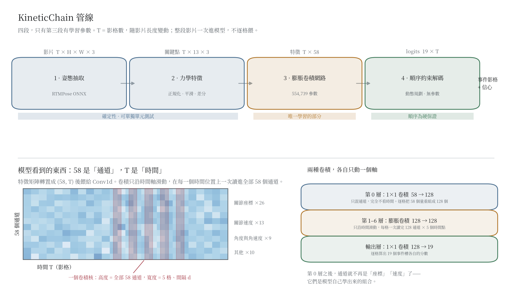
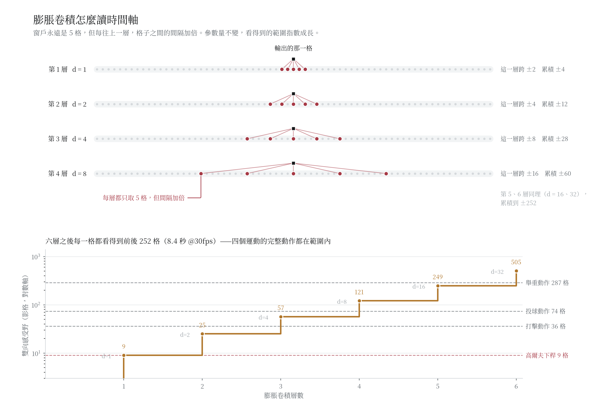
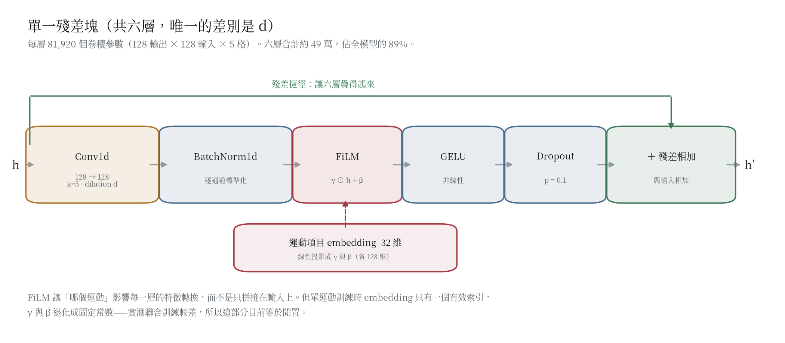
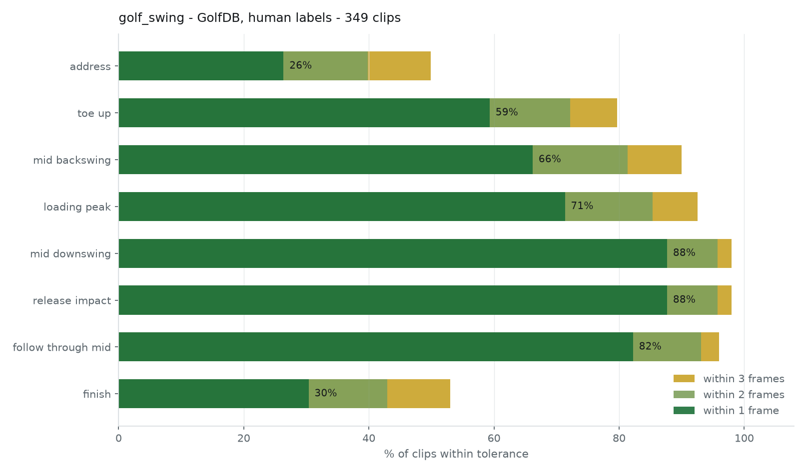
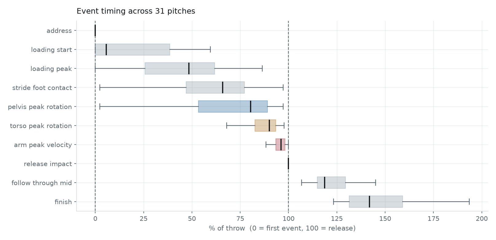
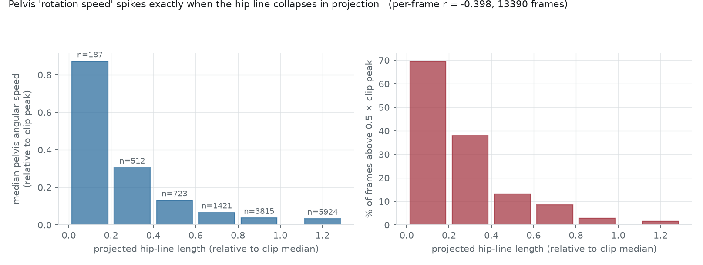
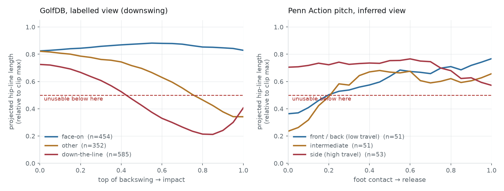
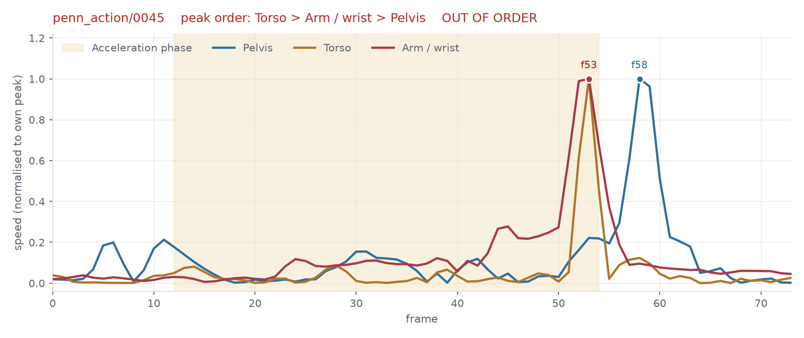

# KineticChain

輸入一段運動影片與運動項目名稱，輸出這個動作的**動力鏈關鍵時間點**——投球的前腳著地、
高爾夫的上桿頂點、擊球瞬間、隨勢終點。這些不是隨便挑的畫面，而是力量由近端傳到遠端的
節點，也是所有後續分析（角度量測、時序比較、動作診斷）的座標系。

**一套流程，每個運動一個模型。** 同一份程式碼、同一個架構、同一組指令，換運動就重新訓練
出該運動專屬的權重；新增運動項目時改的是事件註冊表，不是模型。

> 狀態：實作完成，四折對照實驗已執行。結果見下方 Results。

## Overview

- 研究問題：既有做法幾乎都是一個運動一個模型（GolfDB/SwingNet 是高爾夫專用，標槍、
  花式滑冰各自有獨立資料集與模型），換一個運動就要重做整套流程。但各運動的關鍵時間點
  在力學上共用同一套結構：準備 → 蓄力 → 前腳著地 → 骨盆峰值 → 軀幹峰值 → 上肢峰值 →
  出手／擊球 → 隨勢。這個共通結構能不能拿來做跨運動的知識共享？
- 方法摘要：影片先抽 2D 姿態（RTMPose），轉成與相機距離、畫面位置、慣用邊無關的力學特徵；
  一個共用的膨脹卷積時序骨幹以 FiLM 接受運動項目條件，輸出跨運動共用的事件槽；
  最後以動態規劃在時序約束下解碼，**硬保證**輸出順序符合力學。
- 目前結論：高爾夫在 GolfDB 官方四折平均 PCE **78.6%**（SwingNet 已發表 71.5% / 76.1%）。
  兩個跨運動的嘗試都沒有效益——聯合訓練劣於單運動訓練 0.8 個百分點，跨運動預訓練再微調
  在各資料量下差異都在雜訊內。**建議用法就是一個運動訓練一個模型。** 詳見 Results。

詳細範圍與成功標準見 `docs/spec.md`；實作、演算法與驗證設計見 `docs/architecture.md`。

## 白話說明：這東西怎麼運作

丟一支影片進去，它告訴你「這個動作的關鍵時間點分別在第幾格」。以揮棒為例，輸出十個
時間點：準備、前腳離地、前腳著地、身體扭到最開、骨盆轉最快、軀幹轉最快、上肢最快、
觸球、隨勢中點、結束。

為什麼要這些點？因為動力鏈的核心是**順序**——力量應該從下半身傳到軀幹再到上肢。要看
一個人是不是「只用手打」，看的就是這幾個時間點的先後與間隔。

**第一步，把人從影片裡抽出來變成火柴人。** 用現成的姿態模型（RTMPose）逐格輸出 13 個
關節座標。從這裡開始畫面就丟掉了，後面只看這些點。好處是跨運動通用（人體結構一樣），
壞處是看不到球棒與球。

**第二步，把座標換成與人無關的數字。** 直接用座標不行：人高人矮、站左站右、離鏡頭遠近
都會變。所以換算成 58 個特徵（關節角度、角速度、各部位速度）。這樣一個 180 公分的右打者
和一個 160 公分的左打者，同樣的動作會算出接近的數字。

**第三步，模型讀這串數字，逐格判斷是不是某個事件。** 用的是**膨脹卷積**（dilated
convolution）。一般卷積像拿一個小窗戶在時間軸上滑動，窗戶 5 格在 30 fps 下只有 0.17 秒，
看不出這是動作的哪個階段。膨脹卷積的窗戶一樣是 5 格，但**格子之間跳著取**：第一層看連續
5 格，第二層隔一格取一個，第三層隔三格，之後每層跳的距離加倍（1、2、4、8、16、32）。
參數量沒變，但看得到的範圍指數成長——六層之後每一格的判斷都參考了前後 505 格、約 8 秒。
用一般卷積要看到 505 格得疊 126 層。

為什麼非要看這麼遠？因為關鍵時間點無法只看局部：「上肢速度最快的那一格」是相對的，
得知道整段的速度分布；「準備」是「還沒開始動」，得看到後面動起來才知道前面是準備；
「隨勢中點」的定義直接依賴觸球與結束在哪。

同時**不做降採樣**。一般網路靠 pooling 擴大視野，但那樣輸出就變粗了——要的是「第 22 格」
而不是「大約第 20 到 25 格」。膨脹卷積正好能在不降採樣的前提下擴大視野，這是選它的主因。

**第四步，強制順序。** 模型輸出的是機率，可能給出「觸球早於準備」這種不合力學的答案。
最後一道解碼在所有**符合順序**的組合裡挑機率最高的那組。順序是力學事實，直接寫死在解碼裡，
不是靠訓練去期待模型學會。實測 22 段打擊，順序違規 0 次。

**標註從哪來，是目前最大的問題。** 只有高爾夫有真人標註（GolfDB，有人逐格標了 8 個事件）。
其他運動的資料集只標了關節座標、沒標時間點，所以改用規則推導（「身體速度最低的第一格算
準備」「腳踝高度落回地面算著地」）。這叫**弱標註**，產生的不是真值；模型在上面拿高分只
代表它學會了規則。而且已經查出規則確實有錯——骨盆與軀幹的峰值只有 33% 與 37% 標在訊號
真正的最大值上，見 `docs/batting-analysis.md`。

## 目前支援的運動項目

七個。`idx` 是 embedding 索引（依 id 字母排序，必須穩定）。`python -m kinetic_chain.cli sports`
可以在本機列出同一份資料。

| idx | sport_id | 中文 | 事件數 | canonical | 專屬 | 鏡射 | 標註來源 |
|---:|---|---|---:|---:|---:|:---:|---|
| 0 | `baseball_pitch` | 棒球投球 | 10 | 10 | 0 | 是 | 弱標註 |
| 1 | `baseball_swing` | 棒球揮棒 | 10 | 10 | 0 | 是 | 弱標註 |
| 2 | `bowling` | 保齡球 | 10 | 10 | 0 | 是 | 弱標註 |
| 3 | `clean_and_jerk` | 舉重挺舉 | 9 | 3 | 6 | 否 | 弱標註 |
| 4 | `golf_swing` | 高爾夫揮桿 | 11 | 8 | 3 | 是 | **真人**（GolfDB）+ 弱標註 |
| 5 | `tennis_forehand` | 網球正手拍 | 9 | 9 | 0 | 是 | 弱標註 |
| 6 | `tennis_serve` | 網球發球 | 9 | 9 | 0 | 是 | 弱標註 |

**只有高爾夫有真人標註。** 其餘六個運動的事件時間點是由力學規則從關節訊號推導的
（弱標註），不是真值——模型在上面拿高分只代表它學會了規則。而且已知規則對
`pelvis_peak_rotation` 與 `torso_peak_rotation` 兩個事件標錯位置，見
`docs/batting-analysis.md`。

事件詞彙共 19 槽，所有運動共用：10 個 canonical（跨運動力學定義相同）、
3 個高爾夫專屬、6 個舉重專屬。舉重只用到 3 個 canonical，是共用詞彙適用邊界的直接證據。
各運動的完整事件序列見 `docs/architecture.md` 的「已註冊運動項目」。

## Architecture

四個階段，只有第三階段有學習參數。前後兩段是確定性計算，可以單獨單元測試。



下半張圖是關鍵：**58 維特徵在模型裡是「通道」，不是一串數字。** 特徵矩陣轉置成
`(58, T)` 餵給 `Conv1d`，卷積只沿時間軸滑動，在每一個時間位置上**一次讀進全部 58 個通道**。
第 0 層的 1×1 卷積只混通道、完全不看時間；之後六層的膨脹卷積只沿時間滑動、不改變通道數。
兩種卷積各自只動一個軸。

### 膨脹卷積怎麼讀時間軸



每一層的窗戶永遠是 5 格，但**格子之間的間隔逐層加倍**（1、2、4、8、16、32）。
第 1 層讀連續 5 格，第 6 層讀的 5 格橫跨 ±64。參數量每層固定 81,920 個，
但雙向感受野從 ±4 長到 **±252（505 格 / 8.4 秒 @30fps）**。

下半的對數圖說明為什麼是六層而不是三層或十層：第 4 層才涵蓋得了一次完整投球（74 格），
第 6 層才涵蓋得了一次舉重（287 格）。再多層對這批資料沒有意義。

時間解析度全程不損失——每一層的 padding 都設成 `dilation × (kernel−1) ÷ 2`，
輸出長度恆等於 `T`。要的是「第 22 格」而不是「大約第 20 到 25 格」，所以不做任何降採樣。

### 單一殘差塊



> **FiLM 條件在單運動訓練下不作用。** 它是為了讓一組權重涵蓋多個運動而加的；
> 實測聯合訓練劣於單運動訓練（見 Results），所以預設是一個運動一個模型，此時
> embedding 只有一個有效索引，FiLM 退化成固定的仿射轉換。保留是為了讓聯合訓練
> 的路徑仍可執行與複驗。

三張圖由 `python scripts/plot_architecture.py` 產生。

### 輸出與訓練目標

模型對 19 個事件槽各輸出一條逐影格 logits；某個運動只用到其中幾個槽，其餘遮罩掉。
每一槽在**時間軸**上做 softmax，得到「這個事件發生在第幾格」的機率分布。

- **訓練**：目標不是 one-hot，而是以真值為中心、標準差 `0.05 秒` 的離散高斯，
  損失為 KL 散度。人工標註本身就有 ±1 格的誤差，硬目標會逼模型去擬合標註雜訊。
- **推論**：`decode.constrained_argmax` 以動態規劃求
  `max Σ log p_i(t_i)` s.t. `t₁ ≤ t₂ ≤ … ≤ t_k`，時間 `O(kT)`。
  順序是**硬保證**，不是靠模型學會的——實測 1854 段驗證片段違反數 0。

## Requirements

- Python 3.12（conda 環境 `kinetic-chain`）
- NVIDIA GPU。實測於 RTX 3070 8GB
- 資料集：GolfDB（真人事件標註）、Penn Action（弱標註）——取得方式見下

## Setup

```bash
conda create -y -n kinetic-chain python=3.12
conda activate kinetic-chain
pip install -e ".[pose,data,dev]"
```

### onnxruntime 的兩個坑

兩個都會**靜默**讓姿態抽取退回 CPU（速度從約 330 fps 掉到約 90 fps，不報錯）：

1. `rtmlib` 相依 CPU 版的 `onnxruntime`，裝下去會蓋掉 `onnxruntime-gpu`。以 `--no-deps` 安裝：

   ```bash
   pip install --no-deps rtmlib
   ```

2. `onnxruntime-gpu` 1.21 起要求 CUDA 13，但本專案的 torch 走 cu124。必須裝 `<1.21`：

   ```bash
   pip install --no-deps --force-reinstall "onnxruntime-gpu==1.20.2"
   ```

CUDA 12 的共享函式庫裝在 pip 的 `nvidia/*` 套件裡，不在動態載入器的預設搜尋路徑上。
本環境已加入啟動腳本自動處理：

- `$CONDA_PREFIX/etc/conda/activate.d/onnxruntime_cuda.sh`
- `$CONDA_PREFIX/etc/conda/deactivate.d/onnxruntime_cuda.sh`

確認 GPU 真的有生效：

```bash
python -c "import onnxruntime as ort; print(ort.get_available_providers())"
# 需要看到 CUDAExecutionProvider
```

## Data

`data/` 不納入版本控制。

### GolfDB（真人標註，1400 段）

McNally et al., CVPR-W 2019。每段有 8 個揮桿事件的人工標註，是本專案唯一能與已發表
基準對照的評估集。

```bash
mkdir -p data/raw
curl -L -o data/raw/golfDB.pkl \
  https://github.com/wmcnally/golfdb/raw/master/data/golfDB.pkl

# 影片（160×160 已裁切，約 699 MB）
pip install gdown
gdown 1uBwRxFxW04EqG87VCoX3l6vXeV5T5JYJ -O data/raw/videos_160.zip
unzip -q data/raw/videos_160.zip -d data/raw
```

姿態抽取（RTX 3070 實測約 19 分鐘，產生 40 MB 快取）：

```bash
python -m kinetic_chain.cli extract
```

### Penn Action（弱標註，2326 段中的 7 個運動）

每一影格都有 13 個關節的人工標註，但**沒有事件標註**。事件由
`kinetic_chain/weak_labels.py` 的運動學規則推導。

```bash
curl -L -o data/raw/Penn_Action.tar.gz \
  https://www.cis.upenn.edu/~kostas/Penn_Action.tar.gz
tar -xzf data/raw/Penn_Action.tar.gz -C data/raw --wildcards '*/labels/*'
```

只需要 `labels/`（關節標註）；`frames/` 是影像，本專案不使用，可以不解壓。

**弱標註不是真值。** 模型在弱標註上的分數只說明模型學會了那些規則，不說明規則正確。
所有報表都以 `{運動}/{標註來源}` 分開統計，不合併。

## Run

```bash
# 已註冊的運動項目與其事件
python -m kinetic_chain.cli sports

# 訓練單一運動的模型（建議用法）
python -m kinetic_chain.cli train --sport golf_swing --no-pennaction \
    --val-fold 1 --epochs 60 --output runs/golf

python -m kinetic_chain.cli train --sport baseball_pitch --no-golfdb \
    --epochs 80 --output runs/pitch

# 評估
python -m kinetic_chain.cli eval --checkpoint runs/golf/model.pt \
    --sport golf_swing --no-pennaction --val-fold 1

# 單支影片推論
python -m kinetic_chain.cli infer \
  --checkpoint runs/golf/model.pt --video swing.mp4 --sport golf_swing
```

`--sport` 給多個即為聯合訓練，`--init-from` 可從既有 checkpoint 微調。兩者都實測過，
都沒有比單運動從頭訓練好（見 Results），保留只是為了讓你能自己驗證。

作為函式庫：

```python
from kinetic_chain.infer import predict_video
from kinetic_chain.train import load_checkpoint

model = load_checkpoint("runs/pitch/model.pt", device="cuda")
result = predict_video(model, "pitch.mp4", "baseball_pitch", device="cuda")
print(result.format())
```

## Verify

```bash
pytest
```

118 個測試，全部不需要 GPU、不需要資料集、不需要網路（模型與弱標註以合成動作驗證）。

測試重點在不變式而不是分數：順序約束解碼以窮舉法比對全域最佳解；特徵的平移／縮放／
鏡射不變性；padding 不得被選為事件；checkpoint 與運動項目註冊表不一致時必須拒絕載入。

## Results

完整實驗設計、指令與未執行項目見 `docs/architecture.md` 的 Verification and Experiments。

### 高爾夫（GolfDB 官方四折，真人標註；每折驗證約 349 段，四折合計 1391 段）

| 設定 | 四折平均 PCE |
|---|---|
| SwingNet（論文，RGB + 增強） | 0.761 |
| SwingNet（作者 repo，RGB 無增強） | 0.715 |
| **本專案，只訓練高爾夫** | **0.786 ± 0.006** |
| 本專案，聯合訓練（不含 Penn Action 高爾夫） | 0.779 ± 0.001 |
| 本專案，聯合訓練（七個運動全含） | 0.778 ± 0.006 |

不是嚴格對照：資料集、四折協定與 PCE 定義相同，但本專案吃 2D 姿態、SwingNet 吃 RGB。
SwingNet 的數字引自論文與作者 repo，未在本機重跑。

分數幾乎全部由兩個事件拖累——`address` 0.38、`finish` 0.44，其餘六個事件平均 **0.911**
（SwingNet 論文報告「八個事件中的六個達 91.8%」，困難點相同）。這兩個事件缺乏明確的
力學界線：球員可以在動作前靜止數十影格，而容忍度只有約 2.7 影格。

PCE 看不出實際誤差幾格，直接看誤差分布更清楚（第 1 折 349 段驗證片段）：



中段六個事件有 59–88% 落在 **1 格以內**；`address` 與 `finish` 只有 26% / 30%。
重現：`python scripts/plot_accuracy.py --checkpoint runs/golf/model.pt --sport golf_swing
--val-fold 1 --output docs/figures/golf_accuracy.png`

### 多運動（單一 checkpoint，1856 段訓練 / 463 段驗證）

| 分組 | PCE | 片段數 |
|---|---|---|
| `golf_swing/human` | 0.783 | 278 |
| `tennis_serve/weak` | 0.623 | 33 |
| `baseball_pitch/weak` | 0.581 | 31 |
| `tennis_forehand/weak` | 0.579 | 29 |
| `baseball_swing/weak` | 0.570 | 31 |
| `golf_swing/weak` | 0.531 | 28 |
| `bowling/weak` | 0.503 | 33 |

`weak` 的分數只代表模型學會弱標註規則的程度，與 `human` 的 0.783 不是同一件事，
不可相提並論。

### 需要標多少資料？（新運動的實際參考）

以高爾夫模擬「新運動」，取樣不同的訓練集大小，GolfDB 官方四折：

| 訓練段數 | 從頭訓練 | 五運動預訓練後微調 |
|---|---|---|
| 25 | 0.603 | 0.611 |
| 50 | 0.651 | 0.651 |
| 100 | 0.694 | 0.695 |
| 200 | 0.728 | 0.726 |
| 400 | 0.760 | 0.759 |
| 1042（全部） | 0.787 | 0.790 |

兩個結論：

1. **約 200 段可到 0.73、400 段到 0.76，之後報酬遞減。** 標註預算可以照這個抓。
2. **跨運動預訓練沒有用**——六個資料量下的差距全部在標準差以內，連只有 25 段時也一樣。
   原因是模型吃的已經是手工設計、與運動無關的力學特徵，骨幹裡本來就沒剩多少通用表徵
   可以預訓練；剩下要學的「哪個訊號峰值對應哪個事件」是每個運動各自的知識。

### 跨運動聯合訓練也是有代價的

聯合訓練劣於單運動訓練 0.8 個百分點（0.778 vs 0.786）。隔離實驗把損失拆開：
加入 Penn Action 其他六個運動花 0.7 個百分點，再加入 Penn Action 的**高爾夫**只多花 0.1。

> **2026-08-19 更正。** 舊 schema 下這個拆解是 0.6 + 1.0，我因此把主因歸給「Penn Action
> 高爾夫的弱標註與 GolfDB 真人標註定義不一致」。收緊弱標註合格條件後兩者幾乎一樣
> （−0.007 vs −0.008），也就是剩下的損失幾乎全部來自**跨運動共用本身**。
> 先前被剔除的那批退化弱標註很可能就是衝突的主要來源。

結論不變：這個架構下沒有值得跨運動共用的東西，一個運動一個模型即可。

### 順序不變式

四折共 1391 段 + 多運動 463 段驗證片段，順序違反數 **0**。由解碼器的 DP 轉移限制保證，
並由單元測試以窮舉法比對全域最佳解驗證。

## 舉重分析：兩種動力鏈

第七個運動是舉重挺舉（Penn Action `clean_and_jerk`，60 段）。加它是為了驗證一個
可否證的預測：投球的序列量不出來，是因為旋轉型動力鏈用的**跨身體連線方向角**在 2D
投影下會塌陷；舉重是**伸展型**，用三點夾角，兩條邊都是長節段，不會塌。


同一套流程、同一個指標：

| 動力鏈 | 條件 | 近端→遠端成立率 |
|---|---|---|
| 旋轉（高爾夫） | face-on，最好的機位 | 18%（n=454） |
| 伸展（舉重） | Penn Action，30 fps，多為正面 | 41.7%（n=60） |
| 伸展（舉重） | 同上，只看矢狀面可見 | 64.7%（n=17） |
| **伸展（舉重）** | **自備側面影片，50–60 fps** | **62.5%**（n=8） |
| 隨機基準 | | 16.7% |

預測成立。**機位需求也剛好相反**：旋轉在水平面，要正面／45°；伸展在矢狀面，
**要側面**——正面拍的舉重片段髖角範圍只剩 169–180°，彎曲被完全壓扁。
舉重用側面拍的序列成立率是偏正面的兩倍（64.7% vs 32.6%）。

但**偵測表現幾乎不受視角影響**（0.778 vs 0.736，n=4/8）：事件是用垂直高度定義的
（手腕高度、踝相對骨盆的高度），垂直量在任何水平機位下都看得到；只有需要矢狀面
**夾角**的序列量測才受影響。

另一個架構上的發現：舉重的 9 個事件裡只有 **3 個**用得上 canonical 詞彙
（其他運動用 8–10 個）。canonical 詞彙是從投擲／擊球歸納出來的，
`stride_foot_contact`、`pelvis_peak_rotation`、`release_impact` 都預設了
「單側、旋轉、有釋放物」，換到雙側伸展的舉重就對不上。完整報告見
`docs/lift-analysis.md`。

### 自備影片實測

12 支自己拍的側面舉重影片（1080×1920，42–60 fps）。這是唯一一次在公開資料集之外的驗證，
也是唯一會暴露真實拍攝條件的測試。完整報告見 `docs/own-video-analysis.md`。

**要跑起來得先修兩個缺陷**，兩個都是乾淨資料集不會遇到的：

| 缺陷 | 症狀 | 修法 |
|---|---|---|
| 偵測器抓錯人 | 骨盆逐格最大跳 **810 px**、骨架身高中位只有 115 px（背景的人） | `PoseExtractor._select`：最大的人 × 時間連續性 |
| 影片沒裁切 | 987 格的影片裡真正的舉只有 f430–620，事件全被塞進架槓階段 | `local_video.auto_trim`：以槓最高點為錨往前找槓仍在地面的影格 |

修正後骨盆跳動降到 23–61 px、身高中位 388–700 px。

**結果分成兩半，而且方向相反**：

- **動力鏈順序（不經模型）更好**：62.5% 成立、上肢排最後 75%（Penn Action 是 41.7% / 63.3%）。
  機位指標也證實自備影片更側面（髖角第 5 百分位中位 67° vs 112°）。
- **模型偵測失效**：整體 PCE 0.486（Penn Action 上是 0.750）。頭尾事件撐得住
  （起始／離地／過膝／結束 0.75–0.875），中段全崩（接槓 0.125、站起 0.000、上挺預蹲 0.000）。
  目視確認**弱標註規則是對的**，錯的是模型——它只用 48 段 Penn Action 訓練，跨域泛化不了。
  把影片重取樣到 30 fps 也救不回來（0.444），所以主因不是幀率。

> n = 8，所有比較都是趨勢不是結論。

## 棒球打者分析：一個推翻先前結論的對照

加入 `baseball_swing`（Penn Action 173 段中讀入 110 段）之後，六個旋轉型運動可以並排比較。
只看投影幾何乾淨的片段（避開髖線塌陷的假影）：


| 運動 | 幾何乾淨 n | 序列成立率 | 動力鏈窗長 |
|---|---|---|---|
| `tennis_serve` | 53 | 54.7% | 34 格 |
| `bowling` | 57 | 45.6% | 17 格 |
| **`baseball_swing`** | **74** | **44.6%** | 14 格 |
| `baseball_pitch` | 25 | 44.0% | 18 格 |
| `tennis_forehand` | 61 | 41.0% | 27 格 |
| **`golf_swing`** | 452 | **17.5%** | **9 格** |
| 隨機基準 | | 16.7% | |

**五個運動都遠高於隨機，只有高爾夫在隨機水準。** 最合理的解釋是動作有多快——
窗長與成立率的相關係數 `r = +0.72`，不過六個點的 `p = 0.108`，達不到顯著，
機制還沒被證實。高爾夫下桿只有 9 格（300 ms），三個環節的峰值本來就擠在一起。

重現：`python scripts/rotation_chain_by_sport.py`。

修正後的說法：**旋轉型動力鏈在 30 fps 下可測，但動作越快越測不準，高爾夫已越過界線。**

會誤判的原因值得記下來：高爾夫是唯一有真人標註、樣本最大的運動，它的結果因此被當成
代表性結論。**樣本大不等於有代表性。**

打者另外還是六個運動裡投影幾何最好的（髖線可用率 67%，投手只有 18%）——髖線要到觸球
那一刻才轉向鏡頭，整個揮擊過程都看得見。完整報告見 `docs/batting-analysis.md`。

## 棒球投球分析

除了高爾夫，也做了一組棒球投球的動力鏈分析（Penn Action 139 段，弱標註）。
完整報告見 `docs/pitch-analysis.md`；重跑：

```bash
python -m kinetic_chain.cli train --sport baseball_pitch --no-golfdb \
    --epochs 80 --output runs/pitch
python scripts/pitch_analysis.py --checkpoint runs/pitch/model.pt
```

**結論：分段層級可用，分離時序不可用。**

階段時間量得出來（中位數，30 fps）：蓄力 217 ms / 跨步 200 ms / 加速期 600 ms /
隨勢 683 ms，佔投球期分別是 17% / 14.5% / 45% / 39%。出手瞬間的誤差中位數 1 格。



出手、上肢峰值、軀幹峰值三個箱子都很窄；**骨盆峰值的箱子橫跨了三分之一個投球期**
（IQR 53–89%）——同一個力學事件不該有這種離散度，這是第一個警訊。

但動力鏈真正的核心指標量不出來。直接量原始訊號的峰值（**不套任何順序假設**）：

| 量測範圍 | 近端→遠端序列成立率 |
|---|---|
| 整段片段 | 38.8% |
| 只看加速階段 | 59.0% |
| 隨機猜的基準 | 16.7% |

明顯優於隨機，但遠不到文獻上動作捕捉量到的「近乎必然成立」。

根因不是模型，也不是取樣率，而是 **`features.py` 的一個缺陷**：骨盆／軀幹的「角速度」
由髖線／肩線的方向角微分而來，這條向量在 2D 投影下會縮短，長度趨近零時 `atan2` 對
關鍵點雜訊極度敏感。實測逐格劑量反應完全單調（`r = −0.398`）：髖線相對長度
落在 0.0–0.2 的那些格，有 69.5% 的角速度超過該片段峰值的一半；長度正常時只有 1.4%。
骨盆角速度峰值那一格的髖線長度中位數只剩片段中位數的 **29%**。



**「骨盆峰值旋轉」偵測器實際上是「髖線投影縮短」偵測器。**

### 機位影響很大，但救不了

固定機位不會讓假影消失——運動員自己就會轉九十度以上。機位決定的是**塌陷發生在
動作的哪一刻**。



近端節段的峰值出現在加速期**前段**，所以要看的是那一段的投影長度，不是整段的最小值。

投球（以骨盆水平位移推論視角，n=155）：

| 機位 | n | 前半最短 | 前半可用率 |
|---|---|---|---|
| 正／背面 | 51 | 0.26 | 14% |
| 中間 | 51 | 0.18 | 20% |
| **側面** | 53 | **0.61** | **60%** |

**投手用側面機位是對的**，符合投球分析的既有實務。幾何上說得通：側面機位的視線垂直於
投球方向，動作前段髖線橫在畫面上（最好觀測），要到接近出手、髖部完全打開時才轉向鏡頭。
正／背面機位相反——一開始髖線就指著鏡頭，而那正是骨盆峰值該出現的地方。

GolfDB 有官方視角標註，結論一致（n=1391，量下桿段）：

| 視角 | n | 前半最短 | 前半可用率 |
|---|---|---|---|
| face-on | 454 | **0.81** | **95%** |
| other | 352 | 0.64 | 73% |
| down-the-line | 585 | 0.44 | 36% |

**假影拿掉之後，高爾夫仍在隨機水準**（18.1% vs 16.7%）。我曾據此推論「30 fps 的 2D
姿態對近端到遠端時序沒有鑑別力」——**加入棒球打者後證實那是過度一般化**，見下節。

要量骨盆旋轉，機位理論上最佳是與動作方向成 **45°**（投影長度最低只掉到 71%）；
但分離時間仍需 240 fps 以上。完整分析、修正方向與影響範圍見 `docs/pitch-analysis.md`。

單次投球的三條速度曲線最能看出問題：



軀幹與手腕在**同一格**達峰（1 格 = 33 ms，分不出先後）；骨盆的「峰值」落在**出手之後**，
在真正的加速階段裡骨盆只有自己最大值的 0.22。

> 上面那個 59.0% 必須用無約束量測才有意義。弱標註推導骨盆／軀幹峰值時，把搜尋範圍
> 限制在上肢峰值之前，那條路徑**必然**得出正確順序——拿它來驗證近端到遠端是循環論證。
> `analysis.unconstrained_sequence()` 就是為了避開這件事而存在，並有專門的測試確認
> 它會如實回報順序相反的案例。

## Project Structure

```
src/kinetic_chain/
  events.py          事件詞彙、SportSpec 註冊表、跨運動順序約束   ← 新增運動項目的唯一入口
  skeleton.py        關鍵點布局與跨布局對映（COCO-17 / Penn-13）
  pose.py            RTMPose 抽取（唯一匯入 rtmlib/cv2 的模組）
  features.py        姿態 → 尺度與位置不變的力學特徵；訊號的唯一來源
  weak_labels.py     由力學訊號推導事件的規則實作
  model.py           TCN 骨幹 + FiLM 運動條件 + 共用事件輸出頭
  decode.py          順序約束 Viterbi 解碼，無參數
  metrics.py         PCE 與容忍度（沿用 GolfDB 定義）
  data.py            Clip 記錄、批次組裝、分層切分
  analysis.py        動力鏈時序指標、投影品質診斷、不套順序假設的無約束量測
  datasets/          golfdb（真人）· pennaction · local_video · annotations
  train.py evaluate.py infer.py cli.py
scripts/             17 支實驗、視覺化與繪圖腳本，見 docs/data-map.md
docs/figures/        README 與報告用的圖，皆為圖表，無人物影像
annotations/         人工標註 CSV（preview/ 不進版控）
tests/               118 個測試
docs/spec.md         需求、範圍與成功標準
docs/architecture.md 系統、演算法與驗證設計
docs/pitch-analysis.md 棒球投球動力鏈分析報告
docs/lift-analysis.md  舉重動力鏈分析報告
docs/own-video-analysis.md 自備側面影片的實測與兩個真實影片才暴露的缺陷
docs/batting-analysis.md 棒球打者分析；推翻「旋轉型量不出來」的結論
tools/annotator.html   事件標註網頁工具（本機開啟，無外部相依）
docs/data-map.md       各運動的資料、權重與實驗檔案對照表
```

## Adding a Sport

只改兩個地方，不動模型與訓練程式：

1. 在 `events.py` 用 `register_sport(SportSpec(...))` 宣告事件與時序。事件盡量用
   canonical 詞彙——用了才會跟其他運動共享輸出槽與梯度。
2. 在 `datasets/` 新增轉接模組，把原始資料讀成 `Clip`。

沒有真人事件標註時，在 `SportSpec.weak_rules` 宣告推導規則（規則本身已實作在
`weak_labels.py`，通常不必新增）。

`tests/test_events.py` 會自動涵蓋新註冊的運動：檢查跨運動順序約束、弱標註規則
無循環依賴、輸出槽索引一致。

## Configuration

- `ModelConfig`：`hidden=128`、`num_layers=6`、`kernel_size=5`、`sport_embedding=32`。
  參數量 554,739，雙向感受野 505 影格。輸入 58 維力學特徵，輸出 19 個事件槽。
- `TrainConfig`：`epochs=60`、`batch_size=16`、`learning_rate=3e-4`、
  `sigma_seconds=0.05`（軟目標寬度，以秒定義故與 fps 無關）。
- RTMPose 權重快取於 `~/.cache/rtmlib`，跨 conda 環境共用。

不得把輸入影片、資料集媒體檔或可識別個人的媒體提交到 repository。

## Known Limitations

- 輸入為 2D 姿態，看不到球具與球體。高爾夫的 `golf_toe_up`（桿頭朝上）等定義在器材上的
  事件只能由手部姿態間接推測，精度預期低於直接吃 RGB 的方法。
- 骨盆與軀幹的旋轉角由關鍵點連線的方向角推得。鏡頭非正對時（尤其側面視角，髖線與肩線
  在投影下塌成一點）方向角極不穩定，失真程度尚未量化。
- Penn Action 的事件是弱標註。弱標註的規則刻意把近端到遠端的順序**建構進去**
  （在加速階段的窗內搜尋峰值），因此這批標註不能用來檢驗近端到遠端假說是否成立。
- 弱標註品質未經人工抽檢。
- 假設輸入是已裁切的單人片段，且每個宣告的事件在片段中恰好出現一次。
- 不做運動項目自動辨識、多人追蹤、3D 重建、即時串流。
- 輸出是動作分析的時間點標記，不是動作品質評分，也不是醫療診斷。
- 模型仍保留 sport embedding 與 FiLM 條件機制（約 1.6 萬參數）。單運動訓練時它退化成
  固定的仿射轉換，無害但無用；保留是為了讓聯合訓練的路徑仍可執行。
