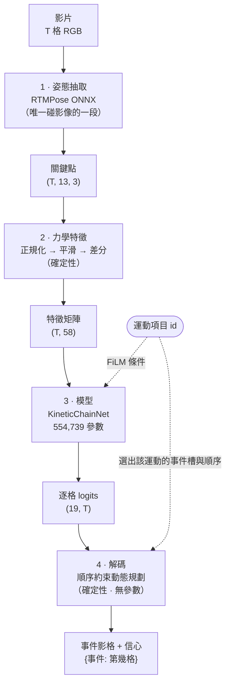
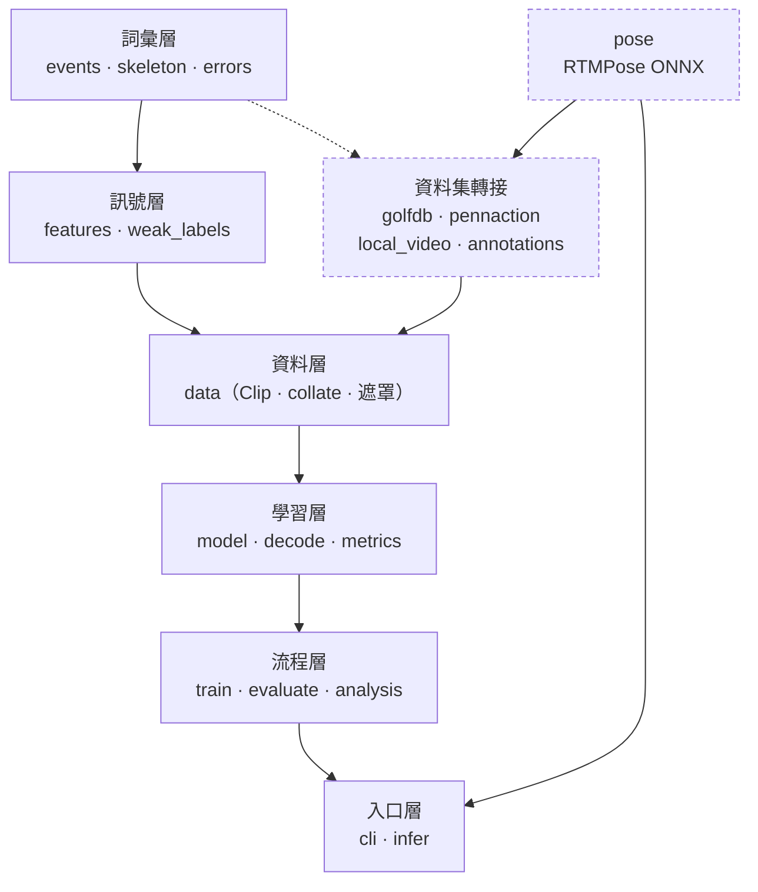
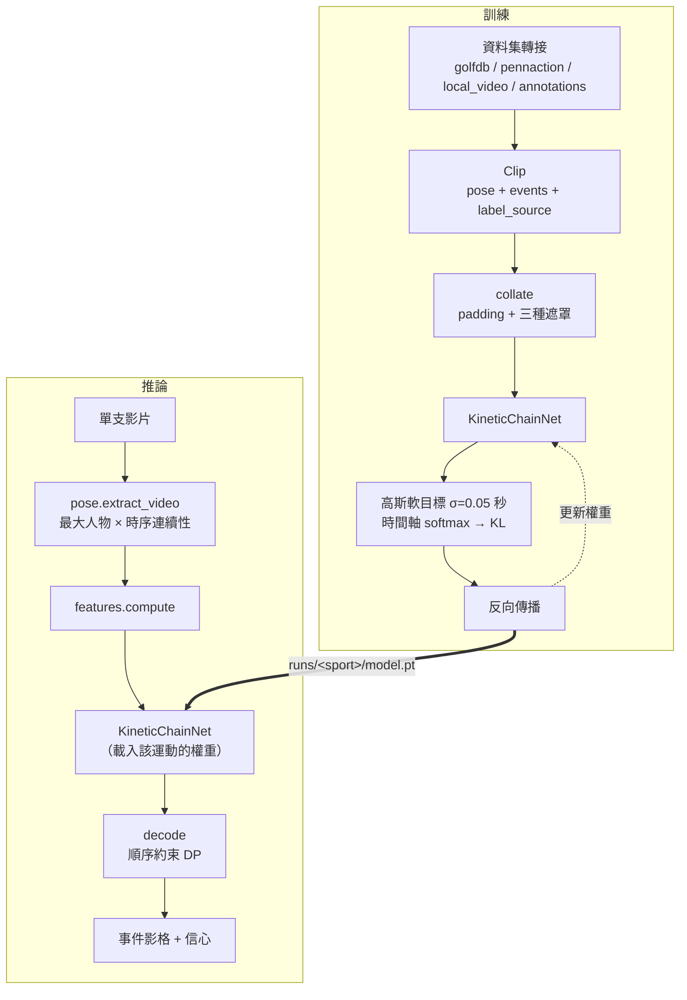

# Architecture and Design

- Requirements source: `docs/spec.md`
- Last updated: 2026-08-26
- Status: 實作完成，130 個單元測試通過。量化實驗結果見 Verification and Experiments。

## Overview

管線分四段，只有第三段有學習參數；其餘三段是確定性計算，可以單獨單元測試。



設計的核心主張：**運動項目的差異放在資料與宣告式設定，不放在模型結構與程式碼**。
因此只有一份訓練程式、一個模型架構、一個推論介面；新增運動項目時改的是事件註冊表與
資料轉接層，**權重則是每個運動各訓練一份**。

初版曾嘗試讓一組權重同時涵蓋多個運動（以 FiLM 接受運動項目條件、共用事件輸出頭），
實測劣於單運動訓練，見 Verification and Experiments 的 S4。條件機制保留在架構中
（`--sport` 給多個即為聯合訓練），但預設與建議用法是**一個運動一個模型**。

## Repository Map

### 核心套件

| 模組 | 行數 | 責任 |
|---|---:|---|
| `events.py` | 662 | 事件詞彙、`SportSpec` 註冊表、順序約束。**新增運動的唯一入口** |
| `skeleton.py` | 160 | 關鍵點布局與跨布局對映（`coco17` / `penn13` / `canonical13`） |
| `features.py` | 407 | 姿態序列 → 58 維力學特徵 `(T, 58)` |
| `weak_labels.py` | 344 | 由力學訊號推導 canonical 事件（**弱標註**，非真值） |
| `model.py` | 227 | `KineticChainNet`：dilated TCN + FiLM 條件 + 共用事件頭 |
| `decode.py` | 110 | 順序約束動態規劃解碼，無參數 |
| `metrics.py` | 152 | PCE 與容忍度 |
| `analysis.py` | 361 | 動力鏈時序指標、投影品質診斷 |
| `segment.py` | 259 | 未裁切長影片 → 一次次的動作片段（門檻式，無參數） |
| `data.py` | 247 | `Clip` 記錄、批次組裝、遮罩 |
| `errors.py` | 35 | 例外階層，全部繼承 `KineticChainError` |

### 邊界層（可以匯入推論後端）

| 模組 | 行數 | 責任 |
|---|---:|---|
| `pose.py` | 244 | RTMPose 抽取（rtmlib/ONNX），輸出 `(T, J, 3)`；含多人選取 |
| `infer.py` | 164 | 單支影片端到端推論 |
| `train.py` | 337 | 訓練迴圈 |
| `evaluate.py` | 120 | 評估 |
| `cli.py` | 261 | 命令列進入點 |

### 資料集轉接層 `datasets/`

| 模組 | 行數 | 來源 | 標註 |
|---|---:|---|---|
| `golfdb.py` | 214 | GolfDB `golfDB.pkl` + 影片 | **真人**，8 事件 |
| `pennaction.py` | 193 | Penn Action `.mat` 關節標註 | 弱標註 |
| `local_video.py` | 211 | 自備影片目錄 | 弱標註（需先抽姿態） |
| `annotations.py` | 194 | `annotations/*.csv` | **真人**（目前 0 段） |

### 其他目錄

| 路徑 | 內容 | 版控 |
|---|---|---|
| `scripts/` | 17 支實驗與視覺化腳本，見 `docs/data-map.md` | 是 |
| `tools/annotator.html` | 瀏覽器人工標註工具，無外部相依 | 是 |
| `tests/` | 130 個測試，不需 GPU／資料集／網路 | 是 |
| `docs/` | spec、architecture、data-map、四份分析報告 | 是 |
| `annotations/` | 人工標註 CSV | 是（`preview/` 除外） |
| `data/` | 資料集與姿態快取 | 否 |
| `runs/` | 訓練輸出與實驗結果 | 否 |
| `gallery/` | 實驗圖片總表（含人物影像） | 否 |

### 模組相依

核心層不得使用 `rtmlib`、`cv2` 或任何推論後端——模型必須能在只有 numpy 的環境下訓練與測試。

分層由上往下相依（上層匯入下層），同層之間不互相匯入。圖刻意做窄以免在 GitHub 上被縮小，
逐模組的細節看下面的表。



`pose.py` 是**唯一使用** `cv2` / `rtmlib` 的模組，而且是在函式內部延遲匯入，不在模組頂層。
因此 `import kinetic_chain.pose` 本身不會拉進任何影像後端，`pytest` 不需要 GPU、
資料集或網路就能跑完 130 個測試。四個資料集轉接模組裡有三個匯入 `pose`（讀姿態快取或
即時抽取），但同樣不會連帶拉進後端。

實際的模組相依（由 AST 抽出，非人工維護）：

| 模組 | 匯入的專案內模組 | 外部後端 |
|---|---|---|
| `errors` | — | |
| `metrics` | — | |
| `segment` | `errors`, `features` | |
| `decode` | `errors` | |
| `skeleton` | `errors` | |
| `events` | `errors` | |
| `features` | `errors`, `skeleton` | |
| `weak_labels` | `errors`, `events`, `features` | |
| `data` | `errors`, `events`, `features` | |
| `model` | `events`, `features` | |
| `analysis` | `events`, `features`, `skeleton` | |
| `evaluate` | `data`, `decode`, `metrics`, `model` | |
| `train` | `data`, `errors`, `evaluate`, `events`, `model` | |
| `pose` | `errors` | **`cv2`**, **`rtmlib`**（函式內延遲匯入） |
| `infer` | `decode`, `errors`, `events`, `features`, `model`, `pose`, `skeleton` | |
| `cli` | `data`, `datasets`, `errors`, `evaluate`, `events`, `infer`, `model`, `train` | |
| `datasets/golfdb` | `data`, `errors`, `pose`, `skeleton` | |
| `datasets/pennaction` | `data`, `errors`, `events`, `features`, `skeleton`, `weak_labels` | |
| `datasets/local_video` | 上列全部 + `pose` | |
| `datasets/annotations` | `data`, `errors`, `events`, `features`, `pose`, `skeleton` | |

## Components and Responsibilities

| 模組 | 責任 | 不負責 |
|---|---|---|
| `events.py` | 定義事件 id、每個運動的事件集合與時序 | 不碰資料、不碰模型 |
| `pose.py` | 影片 → 關鍵點序列 | 不做特徵工程、不做平滑之外的語意處理 |
| `features.py` | 關鍵點 → 尺度/位置不變的力學特徵 | 不知道有哪些事件 |
| `weak_labels.py` | 力學訊號 → canonical 事件影格 | 不用於真人標註的資料集 |
| `model.py` | 特徵序列 + 運動項目 → 每個事件槽的逐影格 logits | 不做解碼、不做遮罩以外的運動項目邏輯 |
| `decode.py` | logits → 符合時序的事件影格 | 沒有可學參數 |
| `datasets/*` | 外部資料 → 統一的 `Clip` 記錄 | 不做特徵、不做模型相關處理 |

### 失敗處理原則

- 姿態抽取在某影格找不到人時，該影格關鍵點信心設為 0，由 `features.py` 以線性內插補值，
  並在 `Clip.coverage` 記錄有效影格比例。覆蓋率低於門檻（預設 0.8）的片段在訓練時排除，
  推論時仍輸出但標記低信心。
- 未註冊的 `sport` id 直接拋 `UnknownSportError`，不做模糊比對。
- 片段長度不足以容納該運動的事件數時拋 `ClipTooShortError`。

## Interfaces and Data Flow

### 核心資料結構

```python
@dataclass(frozen=True)
class SportSpec:
    sport_id: str
    events: tuple[str, ...]         # 依時序排列，id 來自全域事件詞彙
    handedness_sensitive: bool      # 左右打者/投手是否需要鏡射正規化
    weak_rules: tuple[WeakRule, ...]  # 沒有真人標註時的推導規則

@dataclass
class Clip:
    clip_id: str
    sport: str
    pose: np.ndarray               # (T, J, 3) float32, x/y/conf
    fps: float
    events: dict[str, int]         # 事件 id → 影格索引
    label_source: str              # "human" | "weak"，必填
    dataset: str                   # 來源資料集，用於報表分組
    coverage: float                # 關鍵點信心足夠的影格比例
    fold: int | None               # 資料集自帶的官方切分編號
```

`label_source` 是必填欄位而非選填註記：弱標註與真人標註在訓練取樣權重、評估報表上
一律分開統計。

### 資料流

1. `datasets/*.load()` → `list[Clip]`
2. `features.build(clip)` → `(T, F)` float32
3. `data.collate()` → padding 至批次最大長度 + `mask (B, T)` + `sport_ids (B,)` +
   `event_mask (B, E)` + `targets (B, E)`
4. `model(x, sport_ids)` → `logits (B, E, T)`
5. 訓練：對每個 active event 槽，在時間軸上做 softmax，與高斯軟目標算 KL
6. 推論：`decode.decode(logits, spec.slots)` → `(frames, confidence)`

訓練與推論共用第 1 到第 4 步；差別在於**標註從哪裡來**，以及第 5 步之後往哪走。



三種遮罩各自解決一件事，缺一不可：

| 遮罩 | 形狀 | 解決什麼 |
|---|---|---|
| `frame_mask` | `(B, T)` | 批次內片段長度不同，padding 位置的 logits 填 $-\infty$ |
| `event_mask` | `(B, E)` | 每個運動只用 19 個槽中的一部分，未宣告的槽不參與 loss 與解碼 |
| 高斯軟目標 | `(B, E, T)` | 事件時間點本身有標註誤差，硬 one-hot 會逼模型過度自信 |

### 長影片切分

一支十分鐘的訓練影片違反 A1：裡面有 N 次反覆，中間夾著休息、走位、換槓片。
直接餵進去的話，順序約束解碼會強迫模型在整支影片上只輸出一組事件。

`segment.py` 只回答「動作發生在哪幾段」，不回答「事件在第幾格」——後者仍由既有的
模型與解碼負責，對每段各跑一次。**作法是門檻式的，不是學習式的**：以活動量
（`body_speed` 或 `wrist_speed`）低於休息水位的區間當間隔。沿用
`weak_labels` 的 `rest_start` / `rest_end` 早就在用的概念，少一個要驗證的東西。

| 常數 | 值 | 理由 |
|---|---|---|
| `REST_PERCENTILE` | 20 | 休息水位取百分位而非最小值。取最小值會被單格抖動釘死——本專案在 `sagittal_visibility` 上犯過同樣的錯 |
| `ACTIVE_FRACTION` | 0.18 | 高於「休息水位 + 此比例 × 動態範圍」才算在動作中 |
| `MERGE_GAP_SECONDS` | 1.5 | 見下方實測 |
| `MIN_ACTION_SECONDS` | 0.7 | 更短的活動是調整站位、擦手 |
| `MARGIN_SECONDS` | 0.4 | 前後留白，確保 `address` 與 `finish` 落在片段內 |

#### 合併間隔的實測

初版 `MERGE_GAP_SECONDS` 設 0.5 秒。在 12 支自備舉重影片上（每支恰好一次舉，
正解是 1 段）只有 6/12 正確，其餘被切成 2 到 5 段——挺舉的上膊與上挺之間本來就
停 1 到 2 秒。掃描（各訊號恰好切出 1 段的支數）：

| 合併間隔 | `wrist_speed` | `body_speed` |
|---|---|---|
| 0.5 s | 6/12 | 6/12 |
| 1.0 s | 8/12 | 6/12 |
| **1.5 s** | **9/12** | **10/12** |
| 2.5 s | 10/12 | 11/12 |

取 1.5 秒：比動作內部的停頓長，但遠短於反覆之間的休息（舉重通常十秒以上）。
再往上只多對 1 支，卻提高把兩次反覆併成一次的風險。

#### 自我否決

`SegmentationReport.should_trust` 為 False 時仍回傳邊界，但那組邊界不該直接採用。
三種情形：

1. **找不到夠長的活動區間** — 門檻太高，或影片裡沒有完整動作。
2. **有片段貼齊影片邊界** — 動作延伸到畫面之外，起訖無從驗證。同時擋掉「影片從
   動作中途開始」與「整段是連續反覆，活動量從未回到休息水位而被併成一段」。
3. **間隔佔比低於 8%** — 動作之間沒有明顯停頓，門檻法切不出可信的邊界。

12 支自備影片中只有 3 支標為可信，全部因為第 2 條——這些影片確實是拍到舉完就結束。
這是正確的診斷，不是誤判。

#### 已知限制

- **只在單次動作的真實影片上測過。** 手上沒有真正的多次反覆影片，多段的情形只用
  合成序列驗證（`tests/test_segment.py` 把單次動作接成 N 次）。
- **連續反覆的動作切不開。** 連續揮棒練習、跑步這類動作之間不停頓的，第 3 條會擋下來，
  但擋下來不等於有替代方案。
- **參數是運動相關的。** 1.5 秒的合併間隔由舉重定出來，換運動要重新掃描。

## Algorithm Design

### Problem Definition

給定姿態序列 $X \in \mathbb{R}^{T \times J \times 3}$ 與運動項目 $s$，其事件集合
$E_s = (e_1, \dots, e_{k})$ 依力學時序排列。求 $f: (X, s) \mapsto (t_1, \dots, t_k)$，
$t_i \in [0, T)$，且 $t_1 \le t_2 \le \dots \le t_k$。

### Assumptions and Invariants

- A1：片段已裁切，恰好包含一次完整動作。GolfDB 與 Penn Action 都符合。
  未裁切的長影片由 `segment.py` 先切成候選片段再逐段送進管線，見「長影片切分」。
- A2：每個宣告的事件在片段中恰好出現一次。
- A3：**同一運動內**事件時序固定不變（$t_i \le t_{i+1}$）。跨運動則不然，見下方
  「事件順序不是跨運動的不變式」。
- A4：畫面中只有一位目標運動員，或目標運動員為最大偵測框。
- I1：解碼輸出恆滿足 A3（由 DP 的轉移限制保證，不是靠模型自己學會）。
- I2：`event_mask` 為 0 的槽不參與 loss，也不參與解碼。

### 全域事件詞彙

Canonical（跨運動共用輸出槽，力學定義相同）：

| id | 定義 |
|---|---|
| `address` | 動作開始前的靜止準備姿勢 |
| `loading_start` | 反向動作（蓄力）開始 |
| `loading_peak` | 反向動作最大位置（上桿頂點／最大舉腿／最大拉弓） |
| `stride_foot_contact` | 前腳著地，地面反作用力進入動力鏈 |
| `pelvis_peak_rotation` | 骨盆連線方向角的角速度峰值 |
| `torso_peak_rotation` | 肩線方向角的角速度峰值 |
| `arm_peak_velocity` | 遠端上肢（腕）線速度峰值 |
| `release_impact` | 出手／擊球／觸擊瞬間 |
| `follow_through_mid` | 隨勢動作中點 |
| `finish` | 動作結束的靜止姿勢 |

Sport-specific（單一運動專屬，不遷移）：

| id | 所屬運動 | 定義 |
|---|---|---|
| `golf_toe_up` | `golf_swing` | 上桿至桿身水平、桿頭朝上 |
| `golf_mid_backswing` | `golf_swing` | 上桿中段 |
| `golf_mid_downswing` | `golf_swing` | 下桿中段 |
| `clean_liftoff` | `clean_and_jerk` | 槓鈴離地 |
| `clean_knee_pass` | `clean_and_jerk` | 槓鈴通過膝關節高度 |
| `clean_catch` | `clean_and_jerk` | 接槓（前蹲最低點） |
| `clean_recovery` | `clean_and_jerk` | 由前蹲站起完成 |
| `clean_jerk_dip` | `clean_and_jerk` | 挺舉前的預蹲最低點 |
| `clean_overhead` | `clean_and_jerk` | 槓鈴穩定於頭頂 |

模型輸出頭大小 $E = 10 + 9 = 19$，所有運動共用（3 個高爾夫專屬 + 6 個舉重專屬）。

### 已註冊運動項目

七個運動，`sport_index` 即 embedding 索引（依 id 字母排序，必須穩定）。

| idx | sport_id | 顯示名 | 事件數 | canonical | 專屬 | 鏡射 | 資料來源 |
|---:|---|---|---:|---:|---:|:---:|---|
| 0 | `baseball_pitch` | 棒球投球 | 10 | 10 | 0 | 是 | Penn Action |
| 1 | `baseball_swing` | 棒球揮棒 | 10 | 10 | 0 | 是 | Penn Action |
| 2 | `bowling` | 保齡球 | 10 | 10 | 0 | 是 | Penn Action |
| 3 | `clean_and_jerk` | 舉重挺舉 | 9 | 3 | 6 | 否 | Penn Action、自備影片 |
| 4 | `golf_swing` | 高爾夫揮桿 | 11 | 8 | 3 | 是 | **GolfDB（真人）**、Penn Action |
| 5 | `tennis_forehand` | 網球正手拍 | 9 | 9 | 0 | 是 | Penn Action |
| 6 | `tennis_serve` | 網球發球 | 9 | 9 | 0 | 是 | Penn Action |

各運動的事件序列（依時序，`*` 為運動專屬）：

| 運動 | 事件序列 |
|---|---|
| `baseball_pitch` | address → loading_start → loading_peak → stride_foot_contact → pelvis_peak → torso_peak → arm_peak → release_impact → follow_through_mid → finish |
| `baseball_swing` | address → loading_start → **stride_foot_contact → loading_peak** → pelvis_peak → torso_peak → arm_peak → release_impact → follow_through_mid → finish |
| `bowling` | address → loading_start → loading_peak → stride_foot_contact → pelvis_peak → torso_peak → arm_peak → release_impact → follow_through_mid → finish |
| `clean_and_jerk` | address → clean_liftoff\* → clean_knee_pass\* → clean_catch\* → clean_recovery\* → clean_jerk_dip\* → arm_peak → clean_overhead\* → finish |
| `golf_swing` | address → golf_toe_up\* → golf_mid_backswing\* → loading_peak → golf_mid_downswing\* → pelvis_peak → torso_peak → arm_peak → release_impact → follow_through_mid → finish |
| `tennis_forehand` | address → stride_foot_contact → loading_peak → pelvis_peak → torso_peak → arm_peak → release_impact → follow_through_mid → finish |
| `tennis_serve` | address → loading_start → loading_peak → pelvis_peak → torso_peak → arm_peak → release_impact → follow_through_mid → finish |

粗體標出投擲類與擊球類的順序分歧，見下一小節。`baseball_swing` 的
`loading_start` 對應文獻的 lead foot off。

#### Canonical 詞彙的適用邊界

canonical 事件是從**投擲／擊球**歸納出來的，換到別類動作不一定適用。實測：

| 運動 | 事件數 | 用到的 canonical |
|---|---|---|
| `baseball_pitch`、`bowling` | 10 | 10 |
| `baseball_swing`、`tennis_serve`、`tennis_forehand` | 9 | 9 |
| `golf_swing` | 11 | 8 |
| **`clean_and_jerk`** | 9 | **3** |

舉重掉到 3 個，因為 `stride_foot_contact`、`pelvis_peak_rotation`、
`torso_peak_rotation`、`release_impact` 都預設了「單側、旋轉、有釋放物」的動作結構；
舉重是雙側、伸展、沒有釋放。

這不算違反 S3——新增舉重沒有改 `model.py`、`train.py` 或 `decode.py`——但它劃出了
共用詞彙的價值邊界：**canonical 事件槽只在同一類動作之間有共用意義。**
舉重與投球真正共用的力學節點只有 `arm_peak_velocity` 一個
（`address` 與 `finish` 是通用的靜止判定）。詳見 `docs/lift-analysis.md`。

#### 事件順序不是跨運動的不變式

上表的排列是投擲類的典型時序，**不是所有運動共用的順序**。實測時發現投擲類與擊球類
在兩個節點上系統性地相反：

| | 投擲（棒球投球、保齡球） | 擊球（棒球揮棒、網球正手） |
|---|---|---|
| 順序 | `loading_peak` → `stride_foot_contact` | `stride_foot_contact` → `loading_peak` |
| 力學 | 舉腿到最高點，再跨步著地 | 前腳先落地建立支撐，軀幹才拉到最大分離 |

因此權威的順序是每個運動自己的 `SportSpec.events`。真正跨運動成立的只有
`UNIVERSAL_ORDER` 那七條配對（準備在最前、結束在最後、骨盆→軀幹→上肢→釋放→隨勢），
由 `SportSpec.__post_init__` 在註冊時驗證，違反者直接拒絕註冊。

把不成立的約束寫成「跨運動不變式」的後果是拿一個運動的習慣去約束另一個運動；
`tests/test_events.py::test_sports_genuinely_disagree_on_non_universal_order`
明確記錄了這個分歧，避免日後有人「順手」把它收進 `UNIVERSAL_ORDER`。

### 特徵設計

**目的**：讓「同一個動作」在不同的人、不同機位、不同拍攝距離下算出接近的數字。
沒有這一步，模型會把「這個人比較高」或「這支影片拍得比較近」當成動作特徵去學。

#### 三步正規化

1. **骨盆置中**：以骨盆中點為原點，消掉人在畫面中的位置。
2. **尺度正規化**：除以身體尺度。尺度取「肩寬、髖寬、軀幹長」三者逐影格平均後
   **取整段的中位數**。
   - 不只用肩寬與髖寬：這兩條都是跨身體的連線，**側面機位下會投影塌成接近 0**，
     拿它當分母會讓尺度爆炸。軀幹長在正面與側面都存在，用來兜底。
   - 取中位數而非逐影格值：逐影格會讓尺度隨動作變動，等於把動作訊號除掉。
3. **慣用邊鏡射**（僅 `handedness_sensitive` 的運動）：先由「整段速度峰值較大的手腕」
   判定擊球／出手側，再對該手腕的 x 座標做線性擬合，斜率為負就左右鏡射。
   用線性擬合而非首尾差值，是為了抗雜訊。
   - 效果：左打者與右打者統一成同一個方向，訓練資料等於加倍。

y 軸另外翻正（影像座標 y 向下，改為向上為正），這樣「高度」類特徵的正負符合直覺。

#### 58 維特徵的組成

| 群組 | 維度 | 內容 | 為什麼要它 |
|---|---|---|---|
| 關節座標 | 26 | 13 個關節的 $(x, y)$ | 姿勢本身。模型判斷「這是準備還是隨勢」的基礎 |
| 關節速度 | 13 | 每個關節速度大小 $\lVert v \rVert$ | 動力鏈的定義就是速度峰值的時序 |
| 方向角 | 6 | 骨盆線、肩線、肩髖分離角的 $(\sin\theta,\cos\theta)$ | 旋轉型動力鏈的核心量。分離角即 X-factor |
| 角速度 | 3 | 上述三個角的一階差分 | `pelvis_peak_rotation` 等事件直接定義在這上面 |
| 三點夾角 | 2 | 髖角、膝角的 $\cos$ | **伸展型**動力鏈（舉重、跳躍）用，方向角在此類動作上量不到 |
| 伸展速度 | 2 | 髖、膝的伸展角速度 | 同上。只取正值，見下方註記 |
| 高度 | 3 | 腕高、前膝高、前踝高 | `stride_foot_contact`、`loading_start` 的判準 |
| 垂直速度 | 1 | 前踝的垂直速度 | 區分「踩下去」與「抬起來」 |
| 全身速度 | 1 | 12 個關節速度的均值 | `address` / `finish` 的靜止判準 |
| 信心度 | 1 | 該影格量到的關節比例 | 見下方註記 |

#### 幾個設計決定

**角度一律拆成 $(\sin\theta,\cos\theta)$ 兩維。** 角度是循環量，359° 與 1° 實際只差 2°
但數值差 358。直接餵角度會在 $\pm\pi$ 產生假的巨大跳變。拆成 sin 與 cos 就沒有斷點。
代價是三個角佔了 6 維而不是 3 維。

**速度是算好才餵進去，不讓模型自己學差分。** 卷積理論上學得出一階差分，但直接給更穩，
而且動力鏈的定義本來就寫在速度峰值上——把它做成顯式特徵，等於把領域知識直接給模型。

**伸展速度只取正值**（`np.maximum(v, 0)`，不是 `abs`）。用絕對值會把屈曲（下蹲）
與伸展（發力）混為一談，實測把舉重的序列成立率從 41.7% 打到 16.7%，正好等於隨機。
見「Verification and Experiments」。

**`pose_confidence` 是誠實標記。** Penn Action 有 15.5% 的關節標為不可見，這些位置由
`_interpolate_low_confidence` 沿時間軸內插補值。若不告訴模型哪些是補的，補值看起來
會和量到的一樣可信。這一維讓模型至少有機會學會在補值多的影格上降低把握。

**差分前先以 Savitzky–Golay 平滑**，窗長依 fps 縮放。原因是差分會放大高頻雜訊，
而關節座標的抖動正是高頻的。

#### 尺度的量級

58 維相對於直接吃畫面（$160 \times 160 \times 3 = 76{,}800$）小三個數量級，
但模型第一層是 `Conv1d 58 → 128`，實際是**展開**而非壓縮——58 對這個網路而言偏少。
一段 38 影格的片段整體只有 $38 \times 58 = 2204$ 個數字，整段一次進模型。

### 模型

```
features (B, T, F)
  → 1x1 conv 投影到 d=128
  → 6 層 dilated residual TCN（kernel 5，dilation 1,2,4,8,16,32；雙向感受野 505 影格）
      每層以 FiLM 由 sport embedding 調變：h = γ(s) · BN(conv(h)) + β(s)
  → 1x1 conv → logits (B, E, T)
```

選擇 TCN 而非 Transformer 的理由見 Design Decisions。FiLM 條件讓運動項目影響**每一層**的
特徵轉換，而不只是拼接在輸入上；後者在深層網路中容易被忽略。

參數量 554,739（實測）。雙向感受野 505 影格，覆蓋典型片段（GolfDB 長度中位數 282 影格）
的全長，模型看得到動作的兩端。輸入 58 維特徵，輸出 19 個事件槽。

### 訓練目標

對每個 active 事件槽 $e$，在時間軸做 softmax 得 $p_e(t)$，目標為以真值 $t_e^*$ 為中心的
離散高斯 $q_e(t) \propto \exp(-(t - t_e^*)^2 / 2\sigma^2)$，$\sigma$ 依 fps 縮放
（預設 $\sigma = 0.05 \times$ fps 影格）。損失為 $\sum_e {\rm KL}(q_e \| p_e)$，
只對 `event_mask` 為 1 的槽計算。

用軟目標而非單一影格的 one-hot：事件的真值本身有標註誤差（GolfDB 標註者對「impact」
的判定容忍度約 ±1 影格），硬目標會逼模型去擬合標註雜訊。

### 順序約束解碼

給定 $\log p_e(t)$ 與事件順序 $e_1 \dots e_k$，求

$$\max_{t_1 \le t_2 \le \dots \le t_k} \sum_{i=1}^{k} \log p_{e_i}(t_i)$$

DP：$D[i][t] = \log p_{e_i}(t) + \max_{t' \le t} D[i-1][t']$。內層的 $\max_{t' \le t}$ 以
前綴最大值累積，故每層 $O(T)$。

- **正確性**：$D[i][t]$ 依定義為「前 $i$ 個事件、第 $i$ 個落在 $t$」的最佳分數；
  前綴最大值等價於窮舉所有 $t' \le t$，故 DP 遞迴無遺漏。回溯得到的解滿足 $t_i \le t_{i+1}$，
  即不變式 I1。
- **複雜度**：時間 $O(kT)$，空間 $O(kT)$。$k \le 13$、$T$ 數百，成本可忽略。
- **與 argmax 的差異**：獨立 argmax 可能產生 impact 早於 top 的物理上不可能的輸出。
  DP 以全域最佳解排除這類結果，代價是單一事件可能被拉離其獨立最佳位置。

### 弱標註規則（僅用於 Penn Action）

由 `features.py` 已算出的訊號直接取極值，全部確定性、無參數擬合：

| 事件 | 規則 | 搜尋窗 |
|---|---|---|
| `arm_peak_velocity` | 手腕速度大小的最大值 | 全片段 |
| `torso_peak_rotation` | $|\dot\theta_{\rm torso}|$ 的最大值 | ≤ `arm_peak_velocity` |
| `pelvis_peak_rotation` | $|\dot\theta_{\rm pelvis}|$ 的最大值 | ≤ `torso_peak_rotation` |
| `release_impact` | 手腕速度峰值之後減速最劇烈的影格 | ≥ `arm_peak_velocity` |
| `address` | 全身速度均值超過門檻前的最後一個影格 | 全片段 |
| `finish` | 全身速度均值末次超過門檻後的第一個影格 | 全片段 |
| `loading_peak` | 反向動作訊號的極值（依運動指定訊號與方向） | ≤ `pelvis_peak_rotation` |
| `stride_foot_contact` | 前踝抬起後首次回到接近最低高度的影格 | 依運動指定 |
| `loading_start` | 訊號開始朝極值移動的位置 | ≤ `loading_peak` |
| `follow_through_mid` | `release_impact` 與 `finish` 的中點 | — |

求解順序刻意是**由遠端往近端**，與力學傳遞方向相反。理由是 2D 投影下腕點位置明確，
而髖線與肩線在側面視角會塌成一點、方向角極不穩定；先定出最穩健的手腕峰值，
再往回在加速階段內找軀幹與骨盆的峰值。

這個設計有明確代價：**近端到遠端的順序因此是由建構方式保證的，不是由資料驗證出來的**。
不加窗約束時（取全片段極值），1042 段中只有 42 段（4%）能通過時序檢查，違反最多的
就是骨盆→軀幹（489 段）與軀幹→上肢（467 段）——因為隨勢階段的旋轉往往大於加速階段。
加了窗約束後合格率升到 86%–96%。所以這批弱標註**不能**用來檢驗近端到遠端假說是否成立。

推導後仍會套用該運動宣告的完整順序檢查；違反者標記為 `weak_label_invalid` 並排除
（928 段中排除了 86 段），不做「盡量湊」的修補。

**這些規則是弱標註，不是真值。** 模型在弱標註上的分數只說明模型能否學會這些規則，
不說明規則是否正確。規則品質必須另外以人工抽檢估計（尚未執行）。

### Edge Cases

- 片段長度 $T < k$：無法排出 $k$ 個遞增時間點，拋 `ClipTooShortError`。
- 姿態覆蓋率過低（預設 < 0.8）：訓練排除；推論輸出但標記低信心。
- 全部關鍵點信心為 0 的影格：以前後有效影格線性內插；片段頭尾則以最近有效影格外推。
- 動作方向相反（左投／左打）：慣用邊正規化處理；正規化失敗（水平位移過小）時
  不鏡射並記錄。
- fps 缺失或異常（<1 或 >1000）：以 30 fps 代入並記錄警告。

## Verification and Experiments

### Strategy

三層：

1. **單元測試**：確定性元件的正確性——順序約束解碼、特徵不變性（平移/縮放/鏡射）、
   PCE 計算、事件註冊表一致性、資料轉接的 schema。不需 GPU 與資料集。
2. **量化評估**：GolfDB 上的 PCE，與 SwingNet 已發表數字對照。
3. **對照實驗**：聯合訓練 vs 單運動訓練（S4），檢驗跨運動共用是否有益或有害。

### Metric

PCE（Percentage of Correct Events）：預測影格與真值影格差距在容忍度內即為正確。
容忍度沿用 GolfDB 的定義以維持可比性。核對 `wmcnally/golfdb` 的 `util.correct_preds`：

```python
tol = int(max(np.round((events[5] - events[0]) / 30), 1))
```

`events[0]` 是 Address、`events[5]` 是 Impact，故容忍度為「準備到擊球」的影格數除以 30，
下限 1 影格。用相對長度而非固定影格數，慢動作與正常速度的影片才能用同一個標準比。
本專案實作於 `metrics.tolerance()`，一般化為「第一個事件到 `release_impact`」。

整體 PCE 先算每個片段的正確率再平均（同 GolfDB 的 `eval.py`），長短片段權重相同。

> **PCE 不可跨運動比較。** 容忍度與動作長度成正比，所以片段越短標準越嚴：
> 高爾夫平均容忍 2.7 影格，打擊只有 1.0 影格，舉重高達 9.7 影格。同樣差 2 影格，
> 在舉重算命中、在打擊算沒中。跨運動比較必須改用**固定容忍度**或**誤差毫秒數**，
> 見下方「S7」。這一點先前沒有寫清楚，導致舉重的 0.750 被當成比打擊的 0.550 好，
> 實際上兩者的關係是相反的。

### 資料

| 資料集 | 標註 | 讀入 | 捨棄 |
|---|---|---|---|
| GolfDB | 真人，8 事件 | 1391 / 1400 | 9（姿態覆蓋率 < 0.8） |
| Penn Action | 弱標註 | 928 | 55（覆蓋率）、86（弱標註違反時序） |

Penn Action 讀入的分布：保齡球 167、網球發球 163、棒球揮棒 157、棒球投球 155、
網球正手 146、高爾夫 140。GolfDB 片段長度中位數 282 影格，幀率均為約 30 fps。

弱標註在加入搜尋窗約束前的合格率只有 4%（1042 段中 42 段通過時序檢查）；主要原因是
骨盆與軀幹角速度的全片段極值多半落在隨勢階段而非加速階段。改成在加速階段內搜尋後，
各運動的合格率為 86%–96%。這個改動的代價記於「弱標註規則」一節。

### 執行的指令

```bash
pytest                                          # 86 個測試
python -m kinetic_chain.cli extract             # GolfDB 姿態抽取
python scripts/run_experiments.py --output runs/experiments.json
python scripts/run_experiments.py --settings joint_no_penn_golf --skip-multisport \
    --output runs/experiments_ablation.json
python scripts/run_experiments.py --settings finetune_from_others --skip-multisport \
    --output runs/experiments_finetune.json
python scripts/data_efficiency.py --output runs/data_efficiency.json
```

### S2：GolfDB 四折 PCE

協定與 SwingNet 相同（GolfDB 官方四折，每折訓練一次、在該折驗證、四折平均）。
驗證集一律只含 GolfDB 的真人標註。

| 設定 | 四折平均 PCE | 標準差 |
|---|---|---|
| SwingNet（論文，RGB + 增強） | 0.761 | 未報告 |
| SwingNet（作者 repo，RGB 無增強） | 0.715 | 未報告 |
| **本專案 golf_only**（單運動訓練，預設用法） | **0.7860** | 0.0061 |
| 本專案 joint_no_penn_golf（聯合訓練，不含 Penn 高爾夫） | 0.7794 | 0.0013 |
| 本專案 joint（聯合訓練，七運動全含） | 0.7778 | 0.0059 |

> 2026-08-17 重跑。此前的數字是 0.7869 / 0.7810 / 0.7711，在
> **加入關節夾角特徵（54 → 58 維）、加入舉重（事件槽 13 → 19）、
> 並收緊弱標註的合格條件**之後重新訓練。高爾夫幾乎沒變（0.7869 → 0.7860），
> 這正是要的對照——schema 改動沒有破壞既有結果。S4 的結論不變，差距由
> 1.6 個百分點縮小到 0.8。
>
> `finetune_from_others` 這次沒重跑，S6 的結論（微調無效益）沿用舊 schema 的結果。

**這不是嚴格對照。** 相同的是資料集、切分協定與指標定義；不同的是輸入模態
（本專案吃 2D 姿態，SwingNet 吃 RGB）與模型（553K 參數的 TCN vs MobileNetV2+BiLSTM）。
SwingNet 的數字取自論文與作者 repo，未在本機重跑。

### 各事件的 PCE（四折平均，golf_only）

| 事件 | PCE | 事件 | PCE |
|---|---|---|---|
| `address` | 0.396 | `golf_mid_downswing` | 0.968 |
| `golf_toe_up` | 0.788 | `release_impact` | 0.968 |
| `golf_mid_backswing` | 0.877 | `follow_through_mid` | 0.957 |
| `loading_peak`（Top） | 0.906 | `finish` | 0.436 |

分數幾乎全部由 `address` 與 `finish` 拖累：其餘六個事件平均 0.911，與 SwingNet 論文
「八個事件中的六個達 91.8%」幾乎一致。兩者的困難點相同，說明這不是本方法特有的缺陷，
而是這兩個事件本身的定義問題——動作開始前球員可以靜止數十影格，「哪一格算 address」
沒有明確的力學界線，而容忍度只有約 2.7 影格（四折平均）。

### S6：跨運動預訓練 + 微調沒有效益（未達成）

「每個運動各自訓練」的自然延伸是：新運動資料少時，先拿別的運動預訓練，再微調。
實測結果是**沒有用**。

作法：以 Penn Action 的五個運動（709 段，排除高爾夫以免混入定義衝突的弱標註）
預訓練，再在 GolfDB 上微調；對照組為同樣資料量的從頭訓練。GolfDB 官方四折。

| 高爾夫訓練段數 | 從頭訓練 | 微調 | 差 |
|---|---|---|---|
| 25 | 0.603 ± 0.018 | 0.611 ± 0.018 | +0.009 |
| 50 | 0.651 ± 0.013 | 0.651 ± 0.014 | +0.000 |
| 100 | 0.694 ± 0.015 | 0.695 ± 0.017 | +0.001 |
| 200 | 0.728 ± 0.012 | 0.726 ± 0.012 | −0.002 |
| 400 | 0.760 ± 0.008 | 0.759 ± 0.004 | −0.001 |
| 1042（全部） | 0.787 ± 0.004 | 0.790 ± 0.002 | +0.003 |

六個資料量下的差距全部在標準差以內。**預訓練連在只有 25 段的極端情況都沒有明顯幫助。**

合理的解釋：模型吃的已經是手工設計、與運動無關的 54 維力學特徵（骨盆／軀幹角速度、
腕速、踝高等）。「怎麼把畫面變成動作訊號」這件事已經由特徵工程與 RTMPose 做完了，
骨幹本來就沒剩多少通用表徵可以預訓練；剩下要學的是「哪個訊號峰值對應哪個事件」，
而那是每個運動各自的知識，沒得共用。

這個結果同時解釋了 S4：既然骨幹裡沒有可共用的東西，多塞別的運動進來只會帶來干擾。

**實務結論：新運動就直接標資料訓練。** 上表也給了標註量的參考——約 200 段可到
0.73、400 段到 0.76，之後報酬遞減。

（若改成把姿態序列直接餵給模型、不做手工特徵，骨幹就必須自己學表徵，那種設定下
預訓練可能才有意義。未檢驗，屬於另一個設計方向。）

### S4：跨運動共用是有害的（未達成）

`spec.md` 的 S4 要求「聯合訓練不劣於單運動訓練」。**實測不成立**：聯合訓練在
四折上低於單運動訓練，差距 0.8 個百分點（0.7778 vs 0.7860）。四折中三折如此，fold 2 是唯一例外（joint 0.7876 > golf_only 0.7822）——舊 schema 下是四折無一例外，收緊弱標註條件後差距縮小、一致性也降低。

隔離實驗把差距拆成兩塊：

| 訓練集 | PCE | 相對 golf_only |
|---|---|---|
| 只有 GolfDB | 0.7860 | — |
| + Penn Action 的其他六個運動 | 0.7794 | −0.007 |
| + Penn Action 全部七個運動（含高爾夫） | 0.7778 | −0.008 |

**2026-08-19 重跑後這個拆解不再成立。** 舊 schema 下六成損失來自 Penn Action 的高爾夫
弱標註（−0.016 中的 −0.010）；收緊弱標註條件後兩者幾乎一樣（−0.007 vs −0.008），
也就是說剩下的損失幾乎全部來自跨運動共用本身，而不是標註定義衝突。
先前那批被剔除的退化弱標註很可能就是衝突的主要來源。
原因可辨識：Penn Action 高爾夫的 `loading_peak` 由「手腕最高點」推導，而 GolfDB 的
「Top」是人工判定的上桿頂點；兩者灌進同一個事件槽，定義卻不一致。同樣的衝突也發生在
`address` 與 `finish`（弱標註用速度門檻，真人用視覺判斷）——而這兩個正好是分數最差的事件。

結論是**共用事件槽的前提是事件定義一致**，不是只要名字相同就能共用。跨運動共用本身
的代價很小（0.6 個百分點），可接受；標註定義衝突的代價是它的兩倍。

### S1、S3、S5

- **S1（同一套流程可訓練多個運動的模型）：達成。** 六個運動走同一份程式與同一組指令。
  下表是聯合訓練的結果（一次訓練、1856 段訓練 / 463 段驗證），列在這裡是為了記錄
  非高爾夫運動在弱標註上的量級；**建議用法是每個運動各訓練一份權重**，理由見 S4、S6：

  | 分組 | PCE | 片段數 |
  |---|---|---|
  | `golf_swing/human` | 0.783 | 278 |
  | `tennis_serve/weak` | 0.623 | 33 |
  | `baseball_pitch/weak` | 0.581 | 31 |
  | `tennis_forehand/weak` | 0.579 | 29 |
  | `baseball_swing/weak` | 0.570 | 31 |
  | `golf_swing/weak` | 0.531 | 28 |
  | `bowling/weak` | 0.503 | 33 |

  弱標註的分數**只代表模型學會了規則的程度**，與 `golf_swing/human` 的 0.783 不是同一
  件事，不可相提並論。

- **S3（新增運動只需改註冊表）：部分達成。** 六個運動的註冊都只動 `events.py` 與
  `datasets/`，沒有動 `model.py`、`train.py`、`decode.py`。但過程中發現 `SportSpec`
  原本有 `layout` 欄位是設計錯誤（布局屬於資料來源，同一個運動可以來自不同布局的資料集），
  已移除。這類修正屬於抽象本身的缺陷，不算違反 S3，但也說明 S3 只在既有抽象正確時成立。

- **S5（輸出順序恆合法）：達成。** 四折共 1391 段驗證片段、多運動設定 463 段，
  順序違反皆為 0。這由 `decode.constrained_argmax` 的 DP 轉移限制保證，
  並由 `tests/test_decode.py` 以窮舉法比對全域最佳解驗證。

### 一個附帶觀察：未標註事件槽的跨運動遷移

對 GolfDB 影片推論時，模型會輸出 `pelvis_peak_rotation` / `torso_peak_rotation` /
`arm_peak_velocity` 三個 GolfDB **從未標註**的事件。以 `data/raw/videos_160/7.mp4`
為例，這三點落在 171/173/173，介於 `golf_mid_downswing`（預測 167、真值 167）與
`release_impact`（預測 179、真值 178）之間，順序與位置符合下桿的力學。

這些槽只由 Penn Action 的資料訓練過，代表共用事件槽確實把知識帶到了沒有標註的地方。
但**沒有真值可以驗證這三點是否正確**，因此這只是觀察，不是結果；要成為結果需要
高爾夫的骨盆／軀幹峰值真人標註，目前沒有。

### 棒球投球（另有專門報告）

以 `baseball_pitch` 單獨訓練並做動力鏈時序分析，完整結果見 `docs/pitch-analysis.md`。
最重要的一條記在這裡，因為它是本專案方法論的邊界：

**近端到遠端序列在 30 fps 的單機 2D 影片上量不出來。** 直接量原始訊號的峰值
（不套任何順序假設，`analysis.unconstrained_sequence`），139 段投球中序列成立的比例
只有 38.8%（整段）／59.0%（加速階段內），隨機基準是 16.7%。原因是取樣率：文獻上
骨盆→軀幹的分離約 20–50 ms，30 fps 一格 33.3 ms，要量的量與量測解析度同一個數量級；
實測有 14% 落在同一格、30% 順序相反。這不是模型容量或資料量的問題。

這條結果同時說明為什麼弱標註必須把搜尋範圍限制在加速階段內（見「弱標註規則」）——
不限制的話合格率只有 4%。而那個限制正是弱標註不能用來檢驗此假說的原因，兩者互為表裡。

### S7：跨運動的表現差距來自容忍度與資料量，不是模型

各運動的 PCE 相差很大（高爾夫 0.786、投球 0.607、打擊 0.550），先前把它讀成
「打擊比較難」。改用不受容忍度影響的量重跑（`scripts/error_budget.py`），結論相反：

| 運動 | 標註 | 平均容忍度 | 誤差中位 | 誤差中位 | 自身 PCE | PCE@2 格 |
|---|---|---|---|---|---|---|
| `golf_swing` | human | 2.7 格 | 1 格 | 33 ms | 0.793 | 0.765 |
| `baseball_pitch` | weak | 1.7 格 | 1 格 | 33 ms | 0.607 | 0.636 |
| `baseball_swing` | weak | 1.0 格 | 1 格 | 33 ms | 0.550 | **0.677** |
| `clean_and_jerk` | weak | 9.7 格 | 2 格 | 67 ms | 0.750 | **0.509** |

**四個運動的誤差中位數都是 1 影格（舉重 2）。** PCE 的差距幾乎全部來自容忍度。
用固定容忍度排序後名次翻轉：舉重從看起來最好（0.750）變成最差（0.509），
打擊從最差（0.550）變成僅次於高爾夫（0.677）。

真正的差別在**失敗尾巴**。平均誤差與中位數的比值：高爾夫 2.6 倍、打擊 3.4 倍、
投球 6.7 倍、舉重 9.0 倍；p90 誤差分別是 6 / 10 / 22 / 36 影格。分布是雙峰的——
多數片段抓得很準，少數整段抓錯。

#### 資料量 vs 標註品質的歸因

打擊只有 88 段訓練資料而高爾夫有 1042 段，兩個變因綁在一起。把高爾夫降到同樣 88 段、
同樣固定容忍度重訓四折（`scripts/label_vs_data.py`）：

| 設定 | 訓練段數 | PCE@2 格 |
|---|---|---|
| 高爾夫，真人標註 | 1042 | 0.756 ± 0.010 |
| 高爾夫，真人標註 | 88 | 0.658 ± 0.023 |
| 打擊，弱標註 | 88 | 0.677 |

**資料量少的代價是 0.098；扣掉之後打擊比高爾夫還高 0.019。**
換句話說，模型、特徵、取樣率都不是瓶頸，資料量才是。

> 但這**不代表弱標註跟真人標註一樣好**。弱標註是訊號的確定性函數，本來就比人的判斷
> 容易擬合——`rest_start`／`rest_end` 這類邊界事件，弱標註的大錯率 0.113 反而低於
> 真人標註的 0.318，因為人對「什麼時候算準備好」本來就沒有共識。
> 這個實驗量的是**可學習程度**，不是正確程度。正確程度已知有問題：
> 打擊的 `pelvis_peak_rotation` 只有 33% 落在真正的訊號峰值上（見 `docs/batting-analysis.md`）。

#### 失敗集中在哪一類事件

依弱標註規則的種類分組（`scripts/rule_type_errors.py`，大錯 = 差超過 5 影格）：

| 分組 | 代表規則 | 真人標註大錯率 | 弱標註大錯率 |
|---|---|---|---|
| 速度峰值 | `signal_peak`、`post_peak_decel` | 0.011 | 0.255 |
| 姿勢極值 | `signal_extreme` | 0.029 | **0.459** |
| 門檻 | `foot_contact`、`signal_onset` | — | 0.306 |
| 推算 | `midpoint` | 0.014 | 0.060 |
| 邊界 | `rest_start`、`rest_end` | **0.318** | 0.113 |

兩條線索：

1. **姿勢極值與門檻型事件在弱標註下最不可靠**（0.459 / 0.306），但同一類事件在真人標註下
   只有 0.029。所以問題出在**規則的定義**，不是這類事件本身量不到。
2. **邊界事件在真人標註下最差**（0.318），因為「準備」「結束」本來就沒有客觀時刻。
   這一項不是缺陷，是事件定義的固有模糊。

#### 失敗尾巴不能由姿態品質預測

檢驗過三個候選解釋（`n=22` 打擊、`n=28` 投球）：髖線投影品質 `r=+0.13`（p=0.55）、
關節可見率 `r=+0.10`（p=0.66）、片段長度 `r=+0.73`（p<0.001，打擊）。
**姿態品質不預測失敗**；只有動作長度與絕對誤差相關，那是尺度效應。
先前推測「補值多的片段會比較差」不成立。

### Verification Status

| 項目 | 狀態 |
|---|---|
| 單元測試（130 項） | 通過，不需 GPU／資料集／網路 |
| GolfDB 四折 PCE | 已執行，見上表 |
| S4 對照與隔離實驗 | 已執行，S4 未達成 |
| S6 微調 vs 從頭訓練（六個資料量 × 四折） | 已執行，S6 未達成 |
| 棒球投球動力鏈時序分析 | 已執行，見 `docs/pitch-analysis.md` |
| 投球事件定義對照文獻查證 | 已執行，缺 MER／MIR 兩個節點，見 `docs/pitch-analysis.md` |
| 舉重（伸展型動力鏈）分析 | 已執行，見 `docs/lift-analysis.md` |
| 各運動的資料／權重／實驗對照 | 已整理，見 `docs/data-map.md` |
| 順序不變式 | 已執行，違反數 0 |
| 端到端影片推論 | 已執行（`videos_160/7.mp4`），但該片段在訓練集內，只證明管線可用，不證明泛化 |
| S7 誤差預算與資料量歸因 | 已執行，見上；模型不是瓶頸 |
| 弱標註品質的人工抽檢 | **未執行**——需要人工逐段檢視 Penn Action 的事件時間點，本次未做 |
| 弱標註品質的訊號對照 | 已執行——打擊的骨盆／軀幹峰值只有 33%／37% 落在真峰值上，**已知有誤** |
| 2D 投影對骨盆／軀幹角速度的失真量化 | **未執行**——需要有 3D 真值的資料集，手上沒有 |
| SwingNet 基準的本機重現 | **未執行**——直接引用論文與作者 repo 的數字 |
| 未見過的真實影片（非 GolfDB／Penn Action） | **未執行** |

## Design Decisions and Trade-offs

### 以姿態序列而非 RGB 作為模型輸入

SwingNet 直接吃 RGB（MobileNetV2 + LSTM）。本專案改吃 2D 姿態。

- 理由：跨運動共用只有在表示法本身跨運動時才成立。RGB 特徵混入了球場、球具、服裝、
  轉播圖示等與力學無關的資訊，這些在高爾夫與棒球之間完全不共通；關節座標則是同一套
  人體結構。動力鏈本來就定義在關節運動上。
- 代價：損失了與器材相關的線索。高爾夫的 `golf_toe_up`（桿頭朝上）定義在球桿上，
  姿態看不到球桿，只能由手部姿態間接推測。此類事件的精度預期低於 RGB 方法。
- 附帶好處：輸入維度從 $160^2 \times 3$ 降到約 60 維，模型與訓練成本降一個數量級，
  8GB 顯存足夠。

### 事件槽的共用前提是定義一致，不只是名字相同（實驗修正）

原本的設計假設「同名的 canonical 事件可以直接共用輸出槽」。S4 的隔離實驗顯示這個假設
不完整：Penn Action 高爾夫的 `loading_peak`（弱標註，手腕最高點）與 GolfDB 的 Top
（真人標註）灌進同一個槽，使高爾夫的四折 PCE 掉 1.0 個百分點——比加入其他五個運動的
代價（0.6 個百分點）還大。

所以共用的條件應該是「**事件定義一致**」，而不是「事件名稱相同」。目前的設計沒有機制
表達這件事：`SportSpec` 只宣告事件 id，無法宣告「這個運動的這個事件與另一個來源的定義
不相容」。可能的做法包括依 `label_source` 給不同的損失權重，或讓同一事件在定義衝突時
分裂成不同的槽。這是已知缺口，未實作。

### 共用輸出頭 + 遮罩，而非每個運動一個頭

- 每運動獨立頭：運動之間零共享，等同於多個模型塞在一個 checkpoint，違背目標 2。
- 共用頭 + 遮罩：canonical 事件（如 `stride_foot_contact`）在棒球投球與網球發球中
  共用同一個輸出槽，因此兩者的資料互相貢獻梯度。這是「一個模型多運動」的實質內容。
- 代價：不同運動對同一 canonical 事件的視覺表現仍有差異，共用槽可能造成干擾。
  S4 的實測結果是**確實有干擾**（高爾夫掉 0.8 個百分點），而且主要來源是標註定義衝突
  而非運動差異本身。詳見上一節與 Verification and Experiments。

### FiLM 條件而非輸入拼接

sport embedding 若只拼在輸入特徵上，經過 6 層卷積後影響會被稀釋。FiLM 在每層做仿射調變，
讓運動項目能改變特徵的**解讀方式**（例如同樣的腕部速度峰值在投球與揮桿代表不同事件）。
成本是每層多 $2d$ 個參數。

### TCN 而非 Transformer

- 事件定位需要的是精確的局部時間解析度加上足夠的全域脈絡。dilated TCN 以 6 層取得
  約 ±252 影格（雙向 505）的感受野，同時保持逐影格的解析度。
- 資料量小（GolfDB 1400 片段 + Penn Action 數百片段），Transformer 的資料需求不匹配。
- 因果性不需要（離線分析），故用非因果（雙向）卷積。

### 順序約束以解碼強制，而非靠 loss 誘導

用排序損失或懲罰項讓模型「傾向」輸出正確順序，仍可能違反；DP 解碼是硬保證。
且 DP 無參數、無訓練成本、可單元測試。順序是力學事實（A3），適合寫成約束而非學習目標。

### Penn Action 使用弱標註

Penn Action 有 2326 段、15 種動作、每影格 13 個關節的人工標註，但**沒有事件標註**。
選擇以程式化規則產生弱標註，而不是放棄多運動資料，也不是自行人工標註 2000 段影片。

- 這使「多運動」的部分成立，代價是該部分的評估是自我一致性，不是正確性。
- 已在 `Clip.label_source` 中以資料結構層級區分，避免報表混淆。
- 替代方案「只用 GolfDB」會讓專案退化成單運動，直接違背目標。

## Known Gaps

- **模型仍保留 sport embedding 與 FiLM 條件，但單運動訓練用不到。** 單運動時
  embedding 只有一個有效索引，FiLM 退化成固定的仿射轉換（無害但無用，約佔
  1.6 萬個參數）。保留是為了讓聯合訓練的路徑仍可執行；若確定不再用聯合訓練，
  這部分可以拿掉，模型會再小一點。
- **S4 未達成**：聯合訓練劣於單運動訓練 0.8 個百分點。已定位到主因（標註定義衝突）。
  既然單運動訓練本來就是要的用法，此路線不再追。
- **S6 未達成**：跨運動預訓練 + 微調在各資料量下皆無效益。原因見該節；
  要讓遷移有意義可能得改成讓模型直接吃姿態序列、自己學表徵。
- **`address` 與 `finish` 的 PCE 只有 0.40 左右**，是整體分數的瓶頸。這兩個事件缺乏
  明確的力學界線（球員可以靜止數十影格），可能需要改成預測區間而非單一影格。
- 弱標註的品質未經人工抽檢。弱標註的順序約束是建構進去的，不能用來驗證力學假說。
- **弱標註的 `pelvis_peak_rotation` 與 `torso_peak_rotation` 已知標錯位置**：順序約束
  （`before` 參數）把搜尋範圍限制在真峰值之前，打擊上只有 33%／37% 落在真峰值上，
  其餘被推開中位 8／2 影格。修法有三個方向，都未實作：拿掉 `before` 讓解碼器單獨負責
  順序；加最小顯著度門檻，找不到夠強的峰值就讓該段的弱標註不合格；或在投影幾何不佳的
  片段上直接不宣告這兩個事件。見 `docs/batting-analysis.md`。
- **姿勢極值型與門檻型的弱標註規則整體不可靠**（大錯率 0.459 / 0.306，同類事件在真人
  標註下只有 0.029）。`loading_peak`、`stride_foot_contact`、`loading_start` 都屬此類。
- 2D 姿態下骨盆／軀幹旋轉角只能由關鍵點連線推得，鏡頭斜角時的失真未量化。這也是
  弱標註規則必須由遠端往近端求解的直接原因。
- GolfDB 的姿態自行抽取（原資料為 160×160 影片），小解析度下 RTMPose 的精度未量化；
  1400 段中有 9 段因覆蓋率過低被捨棄。
- 未處理球具與球體，涉及器材的事件（`golf_toe_up` 等）精度受限——實測 0.788，
  是三個高爾夫專屬事件中最差的。
- 未在 GolfDB／Penn Action 以外的真實影片上測試過。
