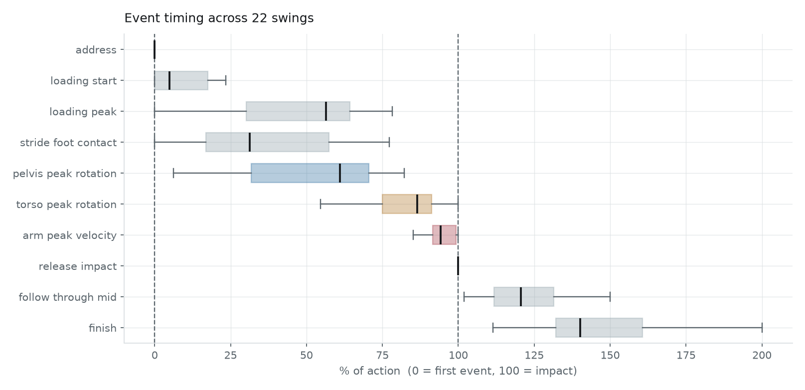
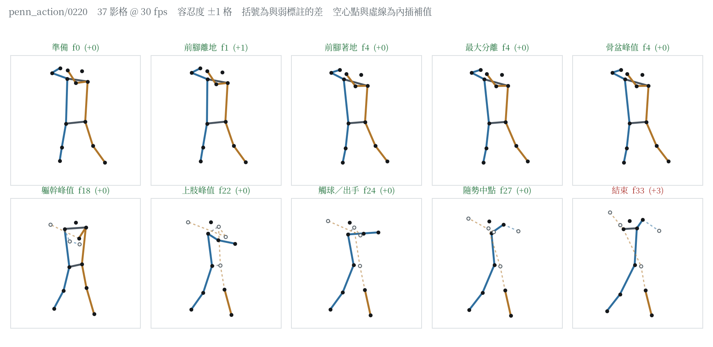
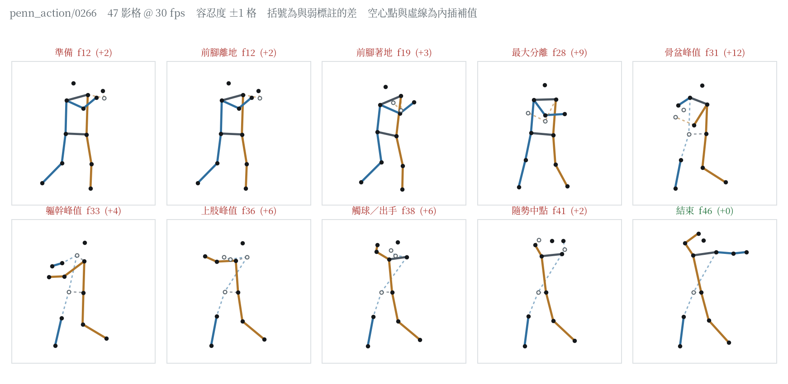
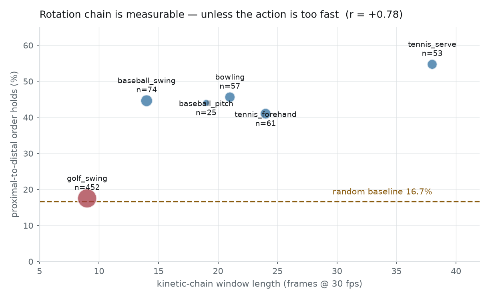
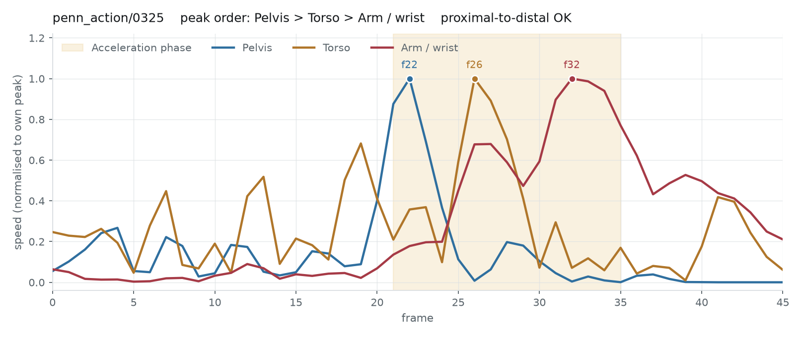
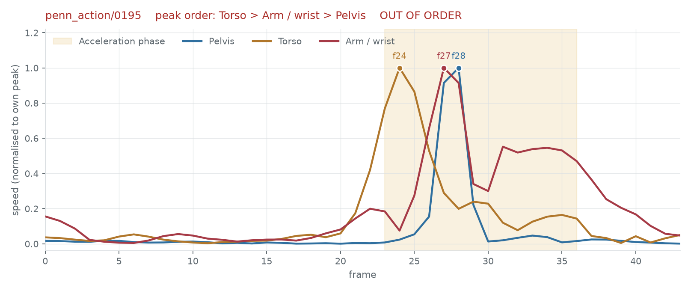

# 棒球打者動力鏈分析

- Date: 2026-08-20
- Model: `runs/bat/model.pt`（`baseball_swing` 單運動訓練，88 段訓練 / 22 段驗證）
- Data: Penn Action `baseball_swing`，173 段中讀入 110 段（弱標註）
- Reproduce: `python -m kinetic_chain.cli train --sport baseball_swing --no-golfdb --epochs 80 --output runs/bat`

## 一句話結論

**打者的投影幾何是六個旋轉型運動裡最好的**（髖線可用率 67%），也因此提供了一個先前
缺少的對照——它推翻了「旋轉型動力鏈在 2D／30 fps 下量不出來」這個結論。
那個結論當初**只根據高爾夫**，而高爾夫是所有運動裡動作最快的。

## 事件定義的查證與修正

對照打擊的六期分法（stance / stride / coiling / swing initiation / swing acceleration /
follow-through）與五個關鍵事件（lead foot off、lead foot down、重心轉移、
前腳最大垂直地面反作用力、觸球）：

| 文獻的關鍵事件 | 本專案對應 |
|---|---|
| lead foot off（跨步開始） | `loading_start` ← **本次補上** |
| lead foot down（前腳著地） | `stride_foot_contact` |
| 最大肩髖分離（coiling 結束） | `loading_peak` |
| — | `pelvis_peak_rotation` → `torso_peak_rotation` → `arm_peak_velocity` |
| bat-ball contact（觸球） | `release_impact` |
| follow-through | `follow_through_mid` → `finish` |

原本少了 **lead foot off**。這是唯一的缺漏，已補上（弱標註規則：前踝高度開始上升，
在著地之前）。補上後事件數 9 → 10，弱標註通過數不變（110 段）。

「重心轉移」與「前腳最大垂直地面反作用力」沒有納入——前者沒有明確的 2D 對應，
後者需要測力板，影片量不到。

文獻描述的動力鏈順序（骨盆峰值角速度先於軀幹峰值角速度）與本專案的 canonical 排序一致。

## 0. 事件時間點的來源

**Penn Action 沒有事件標註。** 它人工標的是每一影格的 13 個關節座標，如此而已。
本文件裡每一個時間點都是由力學規則從關節訊號算出來的（弱標註），規則宣告在
`events.py` 的 `SportSpec.weak_rules`：

| 事件 | 規則 | 實際判準 |
|---|---|---|
| `address` | `rest_start` | 身體速度降到全距 15% 以下的第一格 |
| `loading_start` | `signal_onset` | 前踝高度開始上升（超過起點到極值的 10%），在著地之前 |
| `stride_foot_contact` | `foot_contact` | 前踝高度回落到全距 15% 以內 |
| `loading_peak` | `signal_extreme` | 肩髖分離角在著地與骨盆峰值之間取最大 |
| `pelvis_peak_rotation` | `signal_peak` | 骨盆角速度峰值，限定在軀幹峰值之前 |
| `torso_peak_rotation` | `signal_peak` | 軀幹角速度峰值，限定在上肢峰值之前 |
| `arm_peak_velocity` | `signal_peak` | 腕速全段最大 |
| `release_impact` | `post_peak_decel` | 腕速在峰值後開始明顯減速的那一格 |
| `follow_through_mid` | `midpoint` | 觸球與結束的中點（純算術） |
| `finish` | `rest_end` | 身體速度再次降到靜止門檻以下 |

因此下一節的 PCE 衡量的是「模型多接近**這些規則**」，不是「模型多接近真實的
動力鏈時間點」。規則本身對不對，這批資料無法回答。

## 1. 偵測表現（vs 弱標註）

驗證集 22 段，**容忍度平均只有 1.05 影格**——打擊片段短，容忍度是所有運動裡最嚴的。

| 事件 | PCE | 誤差中位數 |
|---|---|---|
| `arm_peak_velocity` | 0.818 | **0 格** |
| `follow_through_mid` | 0.682 | 1 格 |
| `torso_peak_rotation` | 0.636 | 1 格 |
| `finish` | 0.636 | 1 格 |
| `address` | 0.591 | 1 格 |
| `release_impact` | 0.591 | 1 格 |
| `loading_start` | 0.455 | 2 格 |
| `pelvis_peak_rotation` | 0.409 | 2 格 |
| `loading_peak` | 0.364 | 3 格 |
| `stride_foot_contact` | 0.318 | 2 格 |
| **整體** | **0.550** | |

PCE 看起來低，但**誤差中位數多半只有 1–2 格**。容忍度 1.05 格意味著差 2 格就算沒中——
這個數字與其說是準確度，不如說是「片段短」的後果。

### 逐段結果

彙總數字看不出失敗集中在哪裡。`scripts/bat_report.py` 把驗證集攤成逐段紀錄
（`runs/bat_report.json`）：每段的弱標註影格、模型偵測影格、兩者差、是否落在容忍度內。

- 命中數分布：最好的一段 9/10，最差的 1/10；中位 6/10。
- 22 段的片段長度 31–75 影格，全部 30 fps；容忍度只有 1 或 2 格。
- **失敗不是均勻分布的**——`stride_foot_contact` 錯 15 段、`loading_peak` 錯 14 段，
  其中 **14 段是同時錯**（`loading_peak` 錯的每一段都同時錯了 `stride_foot_contact`）。
  兩者都定義在姿勢而非速度峰值上，這是同一個弱點的兩個表現。

事件時間分布（偵測結果正規化到 0 = 第一個事件、100 = 觸球）：

骨盆峰值中位落在 61%、軀幹 87%、上肢 94%，三者都擠在觸球前的最後三分之一。
箱體寬度代表片段之間的差異：`stride_foot_contact` 的四分位距橫跨 17–57%。

### 單段的原始輸出

`scripts/visualize_poses.py` 把十個事件各畫成一格骨架。畫的是 `features.compute`
正規化後的姿勢，也就是模型實際看到的東西；空心點與虛線是內插補值，不是量到的關節。
不含任何影像像素，因此可以進版控。

最好的一段（9/10）。第一列顯示 **準備 f0、前腳離地 f1、前腳著地 f4、最大分離 f4、
骨盆峰值 f4** ——五個事件擠在前 4 格，姿勢幾乎沒有差別。

最差的一段（1/10）：骨盆峰值差 12 格、最大分離差 9 格。後半段整個左側都是補值，
髖線有一端是補的——而骨盆角速度正是由髖線算出來的。

由這兩張圖量化出兩個先前沒有記錄的限制：

- **十個事件實際只落在 7 個不同影格上**（22 段的中位數；最擠的一段只有 6 個）。
  片段中位 41 影格 @ 30 fps，切十個時間點超過解析度。
  不過平手事件的 PCE 反而較低（0.505 對 0.588，n=101 / 119），所以這**沒有**灌高分數。
- **Penn Action 有 15.5% 的關節標為不可見**（全體平均可見率 84.5%，最差的片段 69.1%）。
  擊球側手腕最嚴重，整段平均只有 74%；在 `arm_peak_velocity` 那一格，
  手腕有 19% 的片段（21/110）是內插補出來的。

> 逐段紀錄裡的 `sequence_from_decoder` 恆為「pelvis → torso → arm」，
> 22 段 0 次順序違規。那是**解碼器強制的結果**，證明解碼器沒出錯，
> 不證明序列在資料上成立。後者見下一節的無約束量測。

## 2. 旋轉型動力鏈：跨六個運動的對照

直接取原始訊號峰值、不套順序假設，**只看投影幾何乾淨的片段**
（髖線最短相對長度 ≥ 0.5，避開 `docs/pitch-analysis.md` 記錄的投影假影）：

| 運動 | 幾何乾淨 n | 成立率 | 髖線最短（全體中位） | 塌陷位置（中位） | 動力鏈窗長 |
|---|---|---|---|---|---|
| `tennis_serve` | 53 / 136 | 54.7% | 0.42 | 0.74 | 34 格 / 1133 ms |
| `bowling` | 57 / 102 | 45.6% | 0.51 | 0.87 | 17 格 / 567 ms |
| **`baseball_swing`** | **74 / 110** | **44.6%** | **0.59** | 0.94 | 14 格 / 467 ms |
| `baseball_pitch` | 25 / 139 | 44.0% | 0.19 | 0.17 | 18 格 / 600 ms |
| `tennis_forehand` | 61 / 107 | 41.0% | 0.55 | 0.43 | 27 格 / 900 ms |
| **`golf_swing`** | 452 / 1391 | **17.5%** | 0.19 | 0.86 | **9 格 / 300 ms** |
| 隨機基準 | — | 16.7% | | | |

窗長 = 動力鏈要在多長時間內完成傳遞（各運動的加速段），取窗長中位數。
塌陷位置 0 = 窗的起點、1 = 窗的終點；打者的髖線要到觸球那一刻才轉向鏡頭，
投手正好相反，一開始就塌。

**窗長與成立率的相關係數 `r = +0.72`，但 `p = 0.108`，六個點達不到顯著**
（Spearman ρ = 0.49，p = 0.33；排除高爾夫後 r = +0.59，p = 0.30）。
穩固的是「五高一低」本身——每個運動至少 25 段，五個都遠離隨機基準；
「窗長決定成立率」是目前最合理的解釋，還不是已證實的機制。

重現：`python scripts/rotation_chain_by_sport.py`。

> **數字修訂（2026-08-21）。** 本節初版的窗長取自一份未留下腳本的臨時計算，
> 相關係數記為 +0.78。補上 `scripts/rotation_chain_by_sport.py` 後窗長改用
> 明確定義的中位數重算，`n` 與成立率完全相同，相關係數變成 +0.72 且不顯著。
> 初版另有一欄「其中落在塌陷點」定義不明、無法重現，已換成塌陷位置中位數。

## 這推翻了先前的一個結論

`docs/pitch-analysis.md` 與 README 先前寫：

> 高爾夫 face-on 是唯一「假影基本不存在」的大樣本，順序成立率 18.1%，隨機基準 16.7%
> ——兩者分不出來。把假影拿掉之後，30 fps 的 2D 姿態對近端到遠端時序完全沒有鑑別力。

**那個推論從高爾夫過度一般化了。** 加入打者之後可以看到：五個運動在幾何乾淨的條件下
都落在 41–55%，遠高於隨機的 16.7%；只有高爾夫在隨機水準。

差別不在運動種類，在**動作有多快**。高爾夫下桿只有 9 格（300 ms），三個環節的峰值
本來就擠在一起；其他運動的窗長是它的 1.5–4 倍。

修正後的說法應該是：**旋轉型動力鏈在 2D／30 fps 下是可測的，但動作越快越測不準；
高爾夫已經越過那條界線。**

這也解釋了先前為什麼會誤判——高爾夫是本專案唯一有真人標註的運動，樣本最大（n=452），
所以它的結果被當成了代表性結論。樣本大不等於有代表性。

### 訊號長什麼樣子

同一個量測，成立與不成立各一例（`scripts/visualize_chain.py --sport baseball_swing`）：

骨盆 f22 → 軀幹 f26 → 上肢 f32，間隔 4 格與 6 格，在 30 fps 下分得開。

軀幹 f24 先達峰，上肢 f27 與骨盆 f28 **只差 1 格**——33 ms 的差距在 30 fps 下量不出來。
這類段落佔多數，也是成立率停在 44.6% 而不是更高的原因。

## 3. 打者為什麼幾何最好

| 運動 | 髖線最短（中位） | 可用率 |
|---|---|---|
| **`baseball_swing`** | **0.6** | **67%** |
| `tennis_forehand` | 0.5 | 57% |
| `bowling` | 0.5 | 56% |
| `tennis_serve` | 0.4 | 39% |
| `golf_swing` | 0.2 | 33% |
| `baseball_pitch` | 0.2 | 18% |

打者的塌陷位置中位數是 **0.94**（0 = 著地、1 = 觸球）——髖線要到觸球那一刻才轉向鏡頭，
整個揮擊過程都看得見。這是打擊轉播機位的副產品：多數 Penn Action 打擊片段是從投手方向
或側面拍的，打者起始時髖線橫在畫面上，轉到觸球才朝向鏡頭。

投手正好相反（塌陷位置 0.73、可用率 18%），原因見 `docs/pitch-analysis.md`。

## 可以直接用的部分

- **上肢峰值速度**：PCE 0.818、誤差中位數 0 格。揮棒速度峰值是打擊分析最常用的量。
  但要記得那一格的擊球側手腕有 19% 的片段是內插補值，不是量到的。
- **旋轉序列**：幾何乾淨的片段有 44.6% 成立，明顯優於隨機。可以看動作是否「用手打」。
- **不可用**：前腳著地（0.318）與最大分離（0.364）。兩者都定義在姿勢上，
  2D 投影下不穩定。

## 未執行

- 沒有真人事件標註。所有分數只代表模型學會弱標註規則的程度。
- 驗證集僅 22 段。
- 沒有分層檢驗打擊的機位（Penn Action 沒有視角標註，也沒做目視分類）。
- 「重心轉移」與「前腳最大垂直地面反作用力」兩個文獻關鍵事件沒有納入，2D 影片量不到。
- 沒有在 Penn Action 以外的打擊影片測試。
- 窗長與成立率的相關不顯著（n=6，p = 0.108）；「動作越快越測不準」是解釋，不是結論。
- 骨架圖只有關節，沒有球棒與球；「觸球」這類事件是否真的落在該格，仍需回頭看原始影格。
