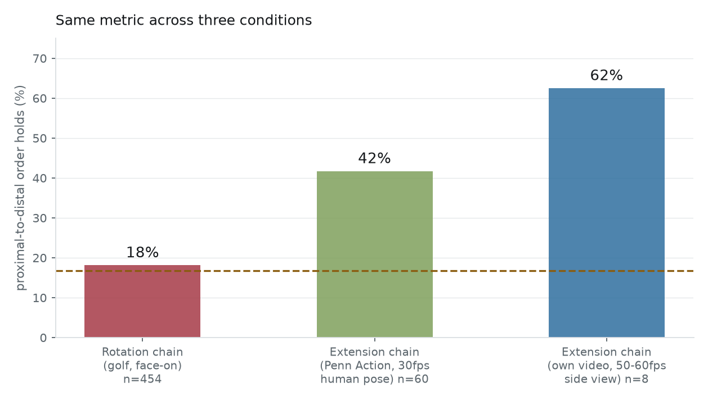
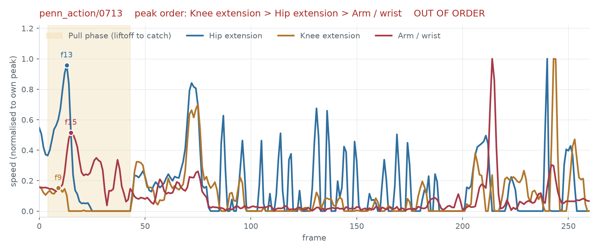

# 舉重（挺舉）動力鏈分析

- Date: 2026-08-19（2026-08-19 修正矢狀面可見度指標與門檻）
- Model: `runs/lift/model.pt`（`clean_and_jerk` 單運動訓練，48 段訓練 / 12 段驗證）
- Data: Penn Action `clean_and_jerk`，88 段中讀入 60 段
- Reproduce: `python scripts/lift_analysis.py --checkpoint runs/lift/model.pt`

## 一句話結論

**伸展型動力鏈量得出來，旋轉型量不出來；而且伸展型需要側面機位。**

同一套流程、同一個指標：舉重的髖→膝→上肢序列成立率整體 **42%**，其中矢狀面拍得清楚的
片段 **64.7%**、偏正面的只有 **32.6%**（隨機基準 16.7%）。高爾夫在最好的機位下只有
18%——與隨機分不出來。差別不在模型，在**量測用的幾何量**與**機位**。

## 為什麼加舉重

前面的投球分析卡在一個問題上：骨盆／軀幹的「角速度」由跨身體連線的方向角微分而來，
這條連線在 2D 投影下會塌陷，量到的是假影（見 `docs/pitch-analysis.md`）。

舉重提供了一個對照：它的動力鏈是**伸展**不是旋轉，用的是**三點夾角**不是方向角。
夾角的兩條邊是軀幹、大腿、小腿這種長節段，不會塌成一點。如果假影理論是對的，
舉重的序列量測應該明顯優於投球——這是一個可以否證的預測。

## 分期定義

> **來源更正（2026-08-30）。** 本節初版寫「依 IWF 與生物力學文獻」，但**沒有指向任何
> 具體出處**，而且對 IWF 的部分是錯的：IWF 的 TCRR 規範的是合法動作的判定
> （槓不得先觸胸、雙腳須回到同一線、除雙腳外身體不得觸台），**完全沒有定義分期**。
> 分期出自運動生物力學文獻，與 IWF 無關。以下是實際查到的來源。

上膊的分期，文獻上是**六期**：第一拉 → 過渡 → 第二拉 → 轉腕 → 接槓 → 站起
（Khuyagbaatar et al. 2024）。三段式的「第一拉／過渡／第二拉」最早出自
Enoka 1979，Garhammer 1985 的奧運選手實測沿用；之後的文獻普遍在其後接上
「轉腕／接槓／站起」（Werner et al. 2021 的用語）。上挺（jerk）另計，
一般分為預蹲、發力、接槓鎖定、回位。

本專案取其中有 2D 姿態對應的 9 個節點。**槓鈴本身沒有關鍵點，一律以手腕代理。**

| 事件 | 對應分期 | 2D 推導規則 |
|---|---|---|
| `address` | 起始 | 全身速度低於門檻的最後一格 |
| `clean_liftoff` | 第一拉開始 | 手腕高度開始上升 |
| `clean_knee_pass` | 第一拉結束 | 手腕高度越過膝高度 |
| `clean_catch` | 接槓 | 骨盆下沉最多的一刻 |
| `clean_recovery` | 站起 | 骨盆回到最高 |
| `clean_jerk_dip` | 上挺預蹲 | 站起後骨盆再次下沉的最低點 |
| `arm_peak_velocity` | 上挺發力 | 手腕速度峰值（canonical） |
| `clean_overhead` | 過頭鎖定 | 手腕高度最大值 |
| `finish` | 結束 | 全身速度回到靜止 |

過渡期的雙膝彎曲（double knee bend）沒有納入——它是膝角的**局部**再屈曲，幅度小，
30 fps 下估計只有兩三格。**這個估計沒有量過**，是憑印象寫的。

### 對照文獻後查出的三個缺口

| 文獻的節點 | 本專案 | 狀態 |
|---|---|---|
| 第一拉 | `clean_liftoff` → `clean_knee_pass` | 有 |
| 過渡（雙膝彎曲） | — | **缺**，理由如上，未量化 |
| **第二拉（三重伸展）** | — | **缺**，見下 |
| 轉腕（turnover） | — | **缺** |
| 接槓 | `clean_catch` | 有 |
| 站起 | `clean_recovery` | 有 |
| 上挺預蹲／發力／鎖定 | `clean_jerk_dip` / `arm_peak_velocity` / `clean_overhead` | 有 |

**最嚴重的是第二拉。** 那是三重伸展發生的地方，也就是這個動作的動力鏈本身，
本專案卻沒有任何事件標記它。目前的 `arm_peak_velocity` 依時間分布落在整段的
**79.7%**，緊接在上挺預蹲（77.7%）之後——那是**上挺的發力**，不是上膊的第二拉。

### 三重伸展的第三環被換掉了

文獻的三重伸展是**髖 → 膝 → 踝**（Kipp et al. 2012；hang power clean 的實測顯示
第二拉期間位移與角速度都呈近端到遠端）。本專案的 `EXTENSION_CHAIN_LINKS` 是
**髖 → 膝 → 上肢**。

踝關節量不到：canonical 13 點沒有腳趾，踝角需要足部節段才算得出來，
所以第三環被換成了上肢。**這個替換先前只寫在 `analysis.py` 的註解裡，
從未對照文獻說明過。** 換掉之後量的已經不是文獻定義的三重伸展。

## Canonical 詞彙在這裡失效

這是本次最重要的架構發現。舉重的 9 個事件裡，只有 **3 個**用得上 canonical 詞彙：

| | 事件 |
|---|---|
| Canonical（3） | `address`、`arm_peak_velocity`、`finish` |
| 專屬（6） | `clean_liftoff`、`clean_knee_pass`、`clean_catch`、`clean_recovery`、`clean_jerk_dip`、`clean_overhead` |

對照其他六個運動：投球、保齡球用滿 10 個 canonical，網球與棒球揮棒用 9 個，
高爾夫 8 個。只有舉重掉到 3 個。

原因不是舉重特別，而是 **canonical 詞彙本身是從投擲／擊球歸納出來的**：
`stride_foot_contact`、`pelvis_peak_rotation`、`torso_peak_rotation`、`release_impact`
全部預設了「單側、旋轉、有釋放物」的動作結構。舉重是雙側、伸展、沒有釋放，
所以對不上。

這**不算違反 S3**（新增運動不必改模型與訓練程式——確實沒改），但它劃出了共用詞彙的
適用邊界：canonical 事件槽只在同一類動作之間有共用價值。舉重與投球共用的三個槽裡，
`address` 與 `finish` 是通用的靜止判定，真正力學上共用的只有 `arm_peak_velocity` 一個。

## 機位：與投球相反

投球的旋轉發生在**水平面**，正面／45° 機位才看得到。舉重的伸展發生在**矢狀面**，
**側面機位才看得到**——正面拍時前後彎曲被投影壓扁。

實測：明顯正面的片段（如 `penn_action/0703`）髖角範圍只剩 **169–180°**，
等於完全量不到彎曲；側面片段可低到 60° 以下。

以髖角的**第 5 百分位**當「矢狀面可見度」的指標（不是最小值，理由見下）：

| | 值 |
|---|---|
| 60 段的中位數 | 112° |
| 矢狀面可見（< 90°） | 17 / 60 |
| 偏正面（≥ 90°） | 43 / 60 |

Penn Action 的挺舉片段以正面與 3/4 為主（88 段目視檢查過），純側面只有約四分之一。
這是資料限制，也讓下面的分層每組樣本偏少。

### 視角的影響：接近兩倍

| 機位 | n | 序列成立率 |
|---|---|---|
| 矢狀面可見（< 90°） | 17 | **64.7%** |
| 偏正面（≥ 90°） | 43 | 32.6% |
| 隨機基準 | — | 16.7% |

排除角度抖動偏大的片段後（52 段）差距一樣：66.7% vs 35.1%。

對照之下，**偵測表現幾乎不受視角影響**：矢狀面可見的 PCE 0.778、偏正面 0.736
（驗證集只有 12 段，分不出差別）。這符合預期——事件是用**垂直高度**定義的
（手腕高度、踝相對骨盆的高度），垂直量在任何水平機位下都看得到；
只有需要矢狀面**夾角**的序列量測會受影響。

> **兩處修正（2026-08-19）。** 初版把門檻定在 120°、且取髖角的**最小值**，
> 結論是「視角沒有影響」（42.0% vs 41.7%）。兩者都錯：
>
> 1. **門檻太寬鬆**——120° 讓 60 段裡有 50 段通過，等於沒有分組。
> 2. **取最小值被雜訊帶走**——有 11 段的髖角最小值低於 25°，那在解剖上不可能
>    （完整深蹲時軀幹貼大腿約 30–40°）；這些片段的角度抖動是其他片段的兩倍
>    （二階差分 RMS 3.2 vs 1.5），最小值與抖動的相關性 `r = −0.44`。
>    所以「最側面」那一組其實是「姿態最吵」那一組，分層結果因此非單調
>    （<45° 只有 25%，45–75° 有 60%）。改取第 5 百分位後與抖動的相關性降到 `+0.16`。

## 1. 偵測表現（vs 弱標註）

驗證集 12 段，容忍度平均 9.67 影格（片段長，中位 271 格）。

| 事件 | PCE | 誤差中位數 |
|---|---|---|
| `address` | 0.917 | 0 格 |
| `clean_liftoff` | 0.917 | 4 格 |
| `clean_knee_pass` | 0.917 | 2 格 |
| `finish` | 0.917 | 1 格 |
| `arm_peak_velocity` | 0.833 | 2 格 |
| `clean_catch` | 0.750 | 1 格 |
| `clean_jerk_dip` | 0.667 | 5 格 |
| `clean_recovery` | 0.417 | 9 格 |
| `clean_overhead` | 0.417 | 12 格 |
| **整體** | **0.750** | |

`clean_recovery` 與 `clean_overhead` 明顯較差。兩者都定義在一段**長時間近乎不變**的
狀態上——站直後可以停留數十格，過頭鎖定後也是。這與高爾夫的 `address`／`finish`
是同一類問題：缺乏明確界線的狀態事件不適合當成單一影格來預測。

**驗證集只有 12 段，這些分數的誤差很大，不應當精確值看。**

> **不要拿這個 0.750 跟其他運動比（2026-08-25 補）。** PCE 的容忍度與動作長度成正比，
> 舉重的片段中位長度 287 影格，平均容忍度高達 **9.7 影格**；打擊只有 1.0、高爾夫 2.7。
> 換成固定 2 影格的容忍度重算，舉重掉到 **0.509**，是四個運動裡**最差**的一個，
> 而不是看起來的最好。誤差中位數也是四個運動裡唯一超過 1 影格的（2 格 / 67 毫秒）。
> 見 `docs/architecture.md` 的 S7。

## 2. 時間分布

驗證集 12 段，正規化到「準備 → 上挺發力」：

| 事件 | 佔比 |
|---|---|
| `address` | 0% |
| `clean_liftoff` | 5.5% |
| `clean_knee_pass` | 5.9% |
| `clean_catch` | 20.3% |
| `clean_recovery` | 56.9% |
| `clean_jerk_dip` | 77.5% |
| `arm_peak_velocity` | 79.7% |
| `clean_overhead` | 97.8% |
| `finish` | 100% |

提鈴（liftoff → catch）只佔 15%，站起與調整佔了 36%——挺舉的大部分時間花在
兩個爆發之間的準備上。

## 3. 伸展型動力鏈序列

直接量原始訊號的峰值，**不套任何順序假設**，搜尋窗為提鈴段（liftoff → catch）：

> **窗的選擇不影響這個結果（2026-08-30 補測）。** 文獻把三重伸展放在第二拉，
> 也就是過膝之後、接槓之前。把窗改成文獻定義的第二拉重算，成立率 40.0%，
> 與現行的 41.7% 幾乎相同（n=60，窗長中位 32.5 對 36 格）。
> 但若不設窗、在整段片段上取全域峰值，會掉到 31.7%——因為膝的伸展峰值有 45% 落到
> 「站起」而非第二拉（站起的膝伸展幅度更大、時間更長）。**設窗是必要的，
> 設在哪一段則不敏感。**

| 量測範圍 | n | 髖→膝→上肢成立率 |
|---|---|---|
| 全部片段 | 60 | 41.7% |
| **矢狀面可見（< 90°）** | 17 | **64.7%** |
| 偏正面（≥ 90°） | 43 | 32.6% |
| 隨機基準 | — | 16.7% |

實際觀察到的排列（全部 60 段）：

| 排列 | 全部 60 段 | 矢狀面可見 17 段 | 偏正面 43 段 |
|---|---|---|---|
| **hip → knee → arm** | **41.7%** | **64.7%** | **32.6%** |
| knee → hip → arm | 21.7% | 23.5% | 20.9% |
| hip → arm → knee | 16.7% | 5.9% | 20.9% |
| arm → hip → knee | 16.7% | 5.9% | 20.9% |
| knee → arm → hip | 1.7% | 0% | 2.3% |
| arm → knee → hip | 1.7% | 0% | 2.3% |

**上肢排在最後的比例**：全部 63.4%、矢狀面可見 **88.2%**、偏正面 53.5%（前兩列相加）。
髖與膝互換在三組都佔 21–24%，那是兩個時間相近的事件在 30 fps 下分不出先後——
與投球遇到的解析度限制同一類，**換機位解決不了**。

換句話說，側面機位改善的是「上肢是不是最後」這件事（53.5% → 88.2%），
不是「髖與膝誰先」（幾乎不變）。前者靠的是矢狀面看得到伸展，後者卡在取樣率。

峰的半高全寬：髖 4 格、膝 3 格、上肢 4 格。比旋轉型訊號寬（骨盆 3 格、軀幹 2 格），
但仍然偏窄，說明雜訊仍在。

### 一個過程中發現並修正的量測錯誤

初版把 `hip_extension_speed` 定義成夾角角速度的**絕對值**，序列成立率只有 16.7%
——正好等於隨機。原因是接槓下蹲時髖膝快速**屈曲**，絕對值把那段算了進來，
而屈曲正是三重伸展的反向動作。改成只取伸展方向（夾角變大）後升到 41.7%。

這個錯誤值得記下來：用絕對值省事，但它把兩個力學意義相反的東西混成同一個量。

## 這次分析可以直接用的部分

- **提鈴分期**：`liftoff`、`knee_pass`、`catch` 的 PCE 都在 0.75 以上，誤差中位數
  1–4 格。切片段、對齊多次試舉夠用。
- **伸展序列的「上肢最後」**：66% 的片段成立，明顯優於隨機。可以拿來看動作是否
  「用手拉」而非「用腿蹬」。
- **不可用**：髖與膝的先後（24% 互換）、雙膝彎曲、槓鈴軌跡（沒有槓鈴關鍵點）。

## 未執行

- **弱標註沒有人工抽檢的量化結果。** 目視檢查了 4 段：`0713`、`0749` 準確；
  `0723` 尚可；**`0756` 明顯錯誤**（`clean_catch` 抓到過頭那一格）。主要失敗模式是
  規則假設了完整的深蹲接槓，遇到 power clean 或不下蹲的動作就抓錯。
- 驗證集只有 12 段，偵測分數的誤差很大。
- 沒有真人事件標註可以驗證規則本身是否正確。
- 沒有真正的側面專拍資料——Penn Action 以正面與 3/4 為主，矢狀面清楚的只有 17 段。
  視角分層的每組樣本因此偏少（17 vs 43），組間差異不應當精確值看。
- 踝關節那一環量不到（canonical 13 點沒有腳趾，測不到蹠屈），所以量的是
  「髖→膝→上肢」而不是完整的三重伸展。
- 沒有槓鈴關鍵點，一律以手腕代理；握距與手腕角度的變化會混進來。文獻的分期是定義在
  **槓的軌跡**上（過膝、過髖），本專案以手腕代理，兩者的偏移量未量化。
- **量的不是文獻定義的動力鏈。** 三重伸展是髖→膝→踝，本專案是髖→膝→上肢。
  上肢在上膊的提鈴段是被動連接槓鈴的環節，不是發力環節，把它當第三環沒有文獻依據。
- **缺三個文獻節點**：過渡（雙膝彎曲）、**第二拉**、轉腕。第二拉是三重伸展所在，
  也就是動力鏈本身，卻沒有事件標記。

## 參考來源

分期定義：

- Khuyagbaatar, B. et al. (2024). Kinematic Comparison of Snatch and Clean Lifts in
  Weightlifters Using Wearable Inertial Measurement Unit Sensors. *Physical Activity and
  Health*, 8(1), 1–9. [DOI 10.5334/paah.306](https://paahjournal.com/articles/10.5334/paah.306)
  ——六期：1st pull、transition、2nd pull、turnover、catch、recovery。
- Enoka, R. M. (1979). The pull in Olympic weightlifting. *Medicine and Science in
  Sports*, 11(2), 131–137.——三段式「第一拉／過渡／第二拉」的原始出處。
- Garhammer, J. (1985). Biomechanical profiles of Olympic weightlifters.
  *International Journal of Sport Biomechanics*, 1(2), 122–130.
  [連結](https://journals.humankinetics.com/view/journals/jab/1/2/article-p122.xml)
- Werner, I., Szelenczy, N., Wachholz, F., & Federolf, P. (2021). How do movement patterns
  in weightlifting (clean) change when using lighter or heavier barbell loads?
  *Frontiers in Psychology*, 11, 606070.
  [PMC7868553](https://pmc.ncbi.nlm.nih.gov/articles/PMC7868553/)

三重伸展與近端到遠端序列：

- Kipp, K., Redden, J., Sabick, M., & Harris, C. (2012). Kinematic and kinetic synergies
  of the lower extremities during the pull in Olympic weightlifting. *Journal of Applied
  Biomechanics*, 28(3), 271–278.
  [連結](https://scholarworks.boisestate.edu/mecheng_facpubs/40/)

**不是來源**：

- IWF *Technical and Competition Rules & Regulations*
  （[2020 版](https://iwf.sport/wp-content/uploads/downloads/2020/01/IWF_TCRR_2020.pdf)）
  規範的是合法動作的判定，**沒有定義分期**。本文件初版誤引，已更正。
