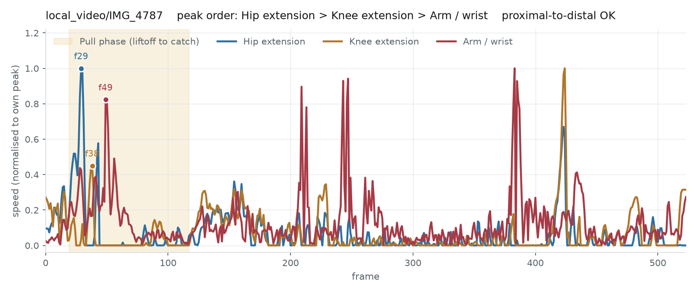

# 自備影片實測（舉重）

- Date: 2026-08-19
- Data: `/srv/datasets/weight` 的 12 支側面舉重影片（1080×1920，42–60 fps，4–16 秒）
- Pose: RTMPose 估計（**不是**人工標註）
- Reproduce:
  ```bash
  python -c "from kinetic_chain.datasets import local_video; \
      print(local_video.extract_poses('/srv/datasets/weight','data/cache/own_weight'))"
  python scripts/lift_analysis.py --source local --checkpoint runs/lift/model.pt \
      --output runs/lift_analysis_local.json
  ```

## 一句話結論

**動力鏈的量測在自備影片上更好，訓練出來的模型卻失效。** 兩者是分開的東西：
序列量測直接從訊號取峰值、不經過模型；偵測則要靠模型泛化。

| | 序列量測（不經模型） | 事件偵測（經模型） |
|---|---|---|
| Penn Action（人工姿態，30 fps，多為正面） | 41.7% | PCE 0.750 |
| **自備影片（RTMPose，50–60 fps，側面）** | **62.5%** | **PCE 0.486** |


## 為了讓管線跑起來，修了兩個真實影片才會暴露的缺陷

公開資料集都是裁切好、單人、乾淨的。自備影片不是，兩個問題都不是調參可以解決的。

### 1. 偵測器抓錯人

`PoseExtractor` 原本每格獨立挑「平均信心最高」的那個人。健身房與比賽場地的背景有其他人，
他們的姿態一樣清晰、信心一樣高，於是偵測器整段都在人之間跳：

| | 修正前 | 修正後 |
|---|---|---|
| 骨盆逐格最大跳動 | **810 px** | 23–61 px（12 支中 10 支） |
| 骨架身高中位 | 115 px | 388–700 px |
| 身高變異係數 | 0.67 | 0.17–0.25 |

改成**畫面上最大的人 × 與前一格的連續性**（`PoseExtractor._select`）。
身高中位從 115 px 跳到 388–700 px，代表原本抓的根本不是舉重者，而是背景的人。

修正後平均信心從 0.82 降到 0.60——那不是變差，是因為現在追的是真正被槓片遮擋的舉重者。

### 2. 影片沒有裁切到單次動作

`docs/architecture.md` 的假設 A1 是「片段已裁切，恰好包含一次完整動作」。
自備影片違反這一點：一支 987 格（16 秒）的影片裡，真正的舉只有 f430–620，
其餘是走位、架槓、放槓。弱標註規則因此把事件全塞進架槓階段
（實測 IMG_4787 的前四個事件全部落在 f0–46）。

新增 `local_video.auto_trim`：以手腕高度的最大值（槓最高）為錨點，往前找最後一次
手腕仍貼近地面高度的影格當起點。用**高度**而不是速度——架槓時身體也在動，速度分不出來，
但槓在不在地上是明確的。

裁切後 IMG_4787 的起點是 f429，與目視判定的 f430 一致。

**通過率：12 支 → 8 支**（4 支弱標註仍不合格；其中 IMG_8702／8703 的自動裁切只框出
0.9 秒，明顯過短）。

## 機位：自備影片明顯優於公開資料集

| | 髖角第 5 百分位（中位） | 矢狀面可見（< 90°） |
|---|---|---|
| Penn Action | 112° | 17 / 60 |
| **自備影片** | **67°** | **6 / 8** |

這正是先前分析指出的需求——伸展型動力鏈發生在矢狀面，要側面拍才看得到。
自備影片是刻意側面拍的，指標也如實反映了。

## 動力鏈順序

搜尋窗為提鈴段（liftoff → catch），直接取原始訊號峰值，**不套任何順序假設**：

| 排列 | 自備影片 (n=8) | Penn Action (n=60) |
|---|---|---|
| **hip → knee → arm** | **62.5%**（5/8） | 41.7% |
| knee → hip → arm | 12.5% | 21.7% |
| knee → arm → hip | 12.5% | 1.7% |
| arm → hip → knee | 12.5% | 16.7% |
| hip → arm → knee | 0% | 16.7% |
| arm → knee → hip | 0% | 1.7% |
| **上肢排在最後** | **75.0%** | 63.3% |
| 隨機基準 | 16.7%（單一排列）／33.3%（上肢最後） | |

髖→膝的分離時間中位數：自備影片 **+50 ms**、Penn Action +33 ms。
60 fps 下 50 ms 是 3 格，30 fps 下 33 ms 是 1 格——高幀率確實給了更多解析度。

峰的半高全寬（換算成毫秒才能跨幀率比較）：自備影片 髖 69 / 膝 72 / 上肢 42 ms；
Penn Action 髖 133 / 膝 100 / 上肢 133 ms。自備影片的峰**更窄**，代表 RTMPose 的
逐格雜訊比人工標註大。



> **n = 8。** 62.5% 是 5/8，信賴區間非常寬（約 25–90%）。這個數字**不足以宣稱**
> 自備影片優於 Penn Action，只能說「方向與預期一致，且沒有變差」。

## 模型偵測：中段事件失效

模型是用 Penn Action 的 48 段訓練的，這 8 支全部沒見過。

| 事件 | PCE | 誤差中位數 |
|---|---|---|
| `address` | 0.875 | 2 格 |
| `clean_knee_pass` | 0.875 | 4 格 |
| `finish` | 0.875 | 2 格 |
| `clean_liftoff` | 0.750 | 4 格 |
| `clean_overhead` | 0.500 | 7 格 |
| `arm_peak_velocity` | 0.375 | 20 格 |
| **`clean_catch`** | **0.125** | **78 格** |
| **`clean_jerk_dip`** | **0.000** | **54 格** |
| **`clean_recovery`** | **0.000** | **55 格** |
| 整體 | 0.486 | |

頭尾事件（起始、離地、過膝、結束）撐得住，**中段全崩**。

目視檢查確認了責任歸屬：**弱標註規則的輸出是對的**（IMG_4787 的
liftoff f448、catch f546、overhead f928 與畫面吻合），錯的是模型。

### 排除了幀率這個解釋

把自備影片重取樣到 30 fps 再跑，整體 PCE 0.444——**沒有救回來**。
`clean_catch` 有改善（0.125 → 0.375），但 `arm_peak_velocity` 反而變差（0.375 → 0.125）。
所以主因不是幀率，而是姿態品質與動作結構的域差異：Penn Action 的挺舉片段較短、
節奏緊湊；自備影片是比賽情境，架槓與站起之間有長時間的停頓。

模型只用 48 段訓練，這種規模本來就不該期待跨域泛化。

## 可以直接用的部分

- **動力鏈順序**：不經過模型，62.5% 成立、上肢排最後 75%，可以拿來看動作是否
  「用手拉」而非「用腿蹬」。
- **提鈴分期的頭尾**：起始、離地、過膝、結束的 PCE 都在 0.75 以上。
- **不可用**：接槓、站起、上挺預蹲（模型誤差 54–78 格）。要用得先擴充訓練資料。

## 未執行

- 沒有人工事件標註，無法驗證弱標註規則本身是否正確（只做了目視檢查）。
- n = 8，所有比較都是趨勢而非結論。
- 4 支影片仍未通過弱標註；`auto_trim` 對其中兩支框出過短的窗口，未修。
- 沒有用自備影片重新訓練模型——那需要更多影片。
- 12 支影片全部是同一種動作型態（clean），沒有抓舉與其他變化。

## 人工標註的格式

目前舉重的事件時間點**全部是程式規則推導的，沒有任何人工標註**——包括本文件的作者
也沒有逐格標過，只做了抽查。要在自備影片上得到真值就得補這一塊。

格式是**寬表 CSV**，一支影片一列、一個事件一欄，可以直接用試算表編輯：

```csv
video,attempt,fps,address,clean_liftoff,clean_knee_pass,clean_catch,clean_recovery,clean_jerk_dip,arm_peak_velocity,clean_overhead,finish,note
IMG_4787,1,59.93,440,451,452,652,731,812,816,879,952,
IMG_8875,1,42.08,233,236,249,308,,,376,378,382,上挺被槓片遮住
```

三條規則：

- **影格編號以原始影片為準**（0 起算），不是裁切後的。裁切是衍生的，標註不該綁在上面。
- **空白不等於 0。** 空白代表「標不出來」（被遮擋、這次動作沒有這個階段），載入時
  該事件會被遮罩掉；填 0 會被當成「發生在第 0 格」，是完全不同的意思。
- **想減少階段數就刪掉那幾欄。** 欄位由標題列決定，程式不寫死事件數。
  欄名必須是 `events.py` 註冊過的 id，打錯直接報錯而不是靜默忽略。

### 不從零開始標

```bash
python scripts/make_annotation_template.py \
    --videos /srv/datasets/weight --cache data/cache/own_weight \
    --sport clean_and_jerk --checkpoint runs/lift/model.pt \
    --output annotations/weight.csv
```

會用現有模型把預測**預先填進去**，標註者只改錯的。依實測，頭尾事件
（起始、離地、過膝、結束）的 PCE 已有 0.75–0.875，那幾欄多半不用動；
要修的是中段（接槓、站起、上挺預蹲）。同時輸出 `annotations/preview/<video>.jpg`，
把預測的那幾格排成一列供對照——**該圖含可辨識個人，不進版控**。

只想標少數幾個階段時加 `--events`：

```bash
--events address clean_liftoff clean_catch clean_overhead finish
```

### 載入

```python
from kinetic_chain.datasets import annotations
clips = annotations.load("annotations/weight.csv", "data/cache/own_weight", "clean_and_jerk")
```

產出的 `Clip.label_source` 是 `"human"`，與弱標註在所有報表中分開統計。
載入時會驗證：欄名是註冊過的事件、影格編號落在影片長度內、順序符合該運動宣告的時序。
任何一項不符直接報錯，不靜默修正。

### 標註工具

`tools/annotator.html` —— 單一檔案的本機網頁，用瀏覽器開即可，不需安裝任何東西、
不連網、無外部相依。做成網頁而不是桌面程式，是因為開發環境是遠端工作階段沒有圖形介面，
而瀏覽器的影片解碼與逐格控制都比自己刻可靠。

```bash
python -m http.server -d tools 8080     # 或直接用瀏覽器開啟 tools/annotator.html
```

流程：載入影片資料夾 → 載入 `annotations/weight.csv`（把預填的預測值帶進來）→
逐格核對 → 匯出 CSV。

- 影格編號由 `currentTime × fps` 換算，fps 取自 CSV；跳格時定位到影格中點避免邊界抖動。
- 鍵盤：方向鍵前後一格（按住 Shift 為十格）、空白播放／暫停、數字鍵把該事件設為目前影格、
  Backspace 清除（留空白＝未標註）、`[` `]` 切換影片。
- 事件欄位由載入的 CSV 決定；**減少階段數只要用少欄位的 CSV**，工具不寫死。
- 匯出的檔案可直接餵給 `datasets/annotations.load()`。

工具本身不含任何影片資料；影片是使用者在瀏覽器端選取的，不會離開本機。
