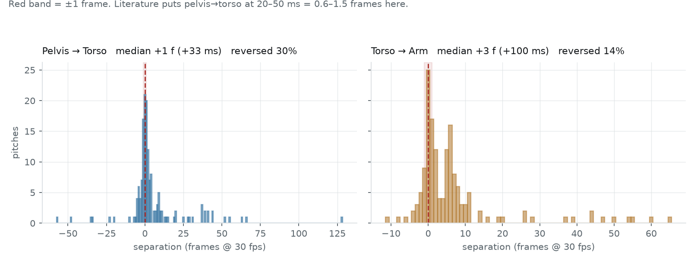

# 棒球投球動力鏈分析

- Date: 2026-08-17（2026-08-17 修正根因歸因，見「為什麼」一節）
- Model: `runs/pitch/model.pt`（`baseball_pitch` 單運動訓練，124 段訓練 / 31 段驗證）
- Data: Penn Action `baseball_pitch`，155 段（讀入時捨棄 1 段覆蓋率過低、11 段弱標註違反時序）
- Reproduce: `python scripts/pitch_analysis.py --checkpoint runs/pitch/model.pt`

## 一句話結論

**分段層級可用，分離時序不可用。** 模型能穩定切出投球的階段（出手、隨勢、結束），
但動力鏈真正的核心指標——骨盆、軀幹、上肢峰值之間相隔幾毫秒——**量不出來**。

根因是 `features.py` 的一個缺陷：骨盆／軀幹的「角速度」由髖線／肩線的方向角微分而來，
而這條向量在 2D 投影下會縮短；長度接近零時 `atan2` 對關鍵點雜訊極度敏感，微分後產生
尖刺。**「骨盆峰值旋轉」偵測器實際上是「髖線投影縮短」偵測器。** 取樣率是次要限制。

## 三個彼此獨立的問題

分析刻意拆成三段，因為它們回答的是不同的事，混在一起會得到錯誤的信心：

| # | 問題 | 方法 | 結果 |
|---|---|---|---|
| 1 | 模型能不能重現弱標註？ | 驗證集 PCE | 0.590 |
| 2 | 各階段的時間長度是多少？ | 由偵測事件換算 | 見下表 |
| 3 | 近端到遠端序列成不成立？ | **直接量原始訊號，不套順序假設** | 36.8% / 56.8% |

第 3 題必須用無約束量測。弱標註推導骨盆／軀幹峰值時，把搜尋範圍限制在上肢峰值之前
（見 `docs/architecture.md` 的弱標註規則），那條路徑**必然**得出正確順序——
拿它來「驗證」近端到遠端，是循環論證。

## 1. 偵測表現（vs 弱標註）

驗證集 31 段，容忍度平均 1.55 影格。

| 事件 | PCE | 誤差中位數 |
|---|---|---|
| `finish` | 0.903 | 0 格 |
| `torso_peak_rotation` | 0.839 | 1 格 |
| `arm_peak_velocity` | 0.677 | 1 格 |
| `release_impact` | 0.677 | 1 格 |
| `follow_through_mid` | 0.613 | 2 格 |
| `pelvis_peak_rotation` | 0.581 | 1 格 |
| `address` | 0.516 | 2 格 |
| `loading_start` | 0.419 | 3 格 |
| `stride_foot_contact` | 0.355 | 3 格 |
| `loading_peak` | 0.323 | 3 格 |

**這些分數只說明模型學會了規則的程度，不說明規則正確。** Penn Action 沒有真人事件標註。

值得注意的是排序：動力鏈的三個峰值（軀幹 0.84、上肢 0.68、骨盆 0.58）反而比
`loading_peak`（最大舉腿，0.32）與 `stride_foot_contact`（前腳著地，0.36）好。
前三者定義在速度峰值上，訊號本身有明確的極值；後兩者定義在姿勢上，弱標註的規則
（膝最高點、踝回到最低）在 2D 投影下不穩定，模型學到的目標本身就吵。

與高爾夫（0.787，真人標註，1042 段訓練）的差距要分開歸因：訓練資料只有 1/8、
標註是規則推導的、且投球的視角變化遠大於高爾夫。**不能直接比。**

## 2. 各階段時序

驗證集 31 段，模型偵測的結果。中位數；30 fps 下 1 格 = 33.3 ms。

| 區段 | 中位（格） | 中位（ms） | IQR（ms） | 佔投球期 % |
|---|---|---|---|---|
| 蓄力 `loading_start → loading_peak` | 12 | 400 | 233 | 21.0 |
| 跨步 `loading_peak → stride_foot_contact` | 7 | 233 | 300 | 13.5 |
| 軀幹加速 `stride_foot_contact → torso_peak` | 12 | 400 | 483 | 22.6 |
| **骨盆→軀幹** | **3** | **100** | 350 | 5.9 |
| **軀幹→上肢** | **2** | **67** | 183 | 5.4 |
| **上肢→出手** | **2** | **67** | 67 | 3.9 |
| 加速期 `stride_foot_contact → release` | 19 | 633 | 34.1 | 34.1 |
| 隨勢 `release → finish` | 21 | 700 | 233 | 41.9 |

全部 155 段用弱標註算的版本（見 `runs/pitch_analysis.json` 的 `timing_reference`）
數量級相同，差異最大的是「軀幹→上肢」（弱標註 167 ms vs 偵測 67 ms）。

階段層級（蓄力、跨步、加速、隨勢）的數字量級合理、IQR 也在可解釋的範圍。
**但粗體那三列不能用**，理由見下一節。

`release_impact` 幾乎沒有離散度（定義上是 100%），`arm_peak_velocity` 緊貼其前
（IQR 89–98%），`torso_peak_rotation` 稍前（IQR 83–95%）。而 `pelvis_peak_rotation`
的 IQR 是 53–89%——橫跨三分之一個投球期。

## 3. 近端到遠端序列：實際上量不出來

直接取原始訊號的峰值，不套任何順序假設，155 段全部：

| 量測範圍 | 近端→遠端成立率 |
|---|---|
| 整段片段 | **36.8%** |
| 只看加速階段（前腳著地 → 出手） | **56.8%** |

隨機猜三個環節的排列，正確率是 1/6 = 16.7%。所以 56.8% 明顯優於隨機，
訊號裡確實有東西；但離運動生物力學文獻用動作捕捉量到的「近乎必然成立」差得很遠。

實際觀察到的排列分布（加速階段內）：

| 排列 | 比例 |
|---|---|
| pelvis → torso → arm | 56.8% |
| torso → pelvis → arm | 18.1% |
| torso → arm → pelvis | 11.0% |
| pelvis → arm → torso | 7.7% |
| arm → pelvis → torso | 5.2% |
| arm → torso → pelvis | 1.3% |

### 為什麼——投影假影（主因）

> **這一節取代了本文件初版的歸因。** 初版把序列量不出來歸因於取樣率。取樣率確實是
> 限制之一，但不是主因，而且這個差別會導向完全不同的解法：若只是取樣率，換一台
> 240 fps 相機就好；實際上是特徵層的缺陷，**換相機不會好**。

先看訊號本身。峰的半高全寬（真正的節段旋轉應有十幾格寬）：

| 訊號 | 中位寬度 | ≤2 格的比例 |
|---|---|---|
| `wrist_speed` | 5 格 | 5% |
| `pelvis_angular_speed` | 3 格 | 45% |
| `torso_angular_speed` | 2 格 | **66%** |

手腕訊號有實體；骨盆與軀幹大多是**單格尖刺**——那是雜訊的形狀，不是旋轉的形狀。

成因可以直接量出來。骨盆角速度峰值發生的那一格，髖線投影長度只有該片段中位數的
**23%**（89% 的片段如此）。把 155 段逐格攤開（13,390 格）看劑量反應：

| 髖線相對長度 | 影格數 | 角速度中位（相對峰值） | >0.5×峰值的比例 |
|---|---|---|---|
| 0.0 – 0.2 | 187 | 0.871 | **69.5%** |
| 0.2 – 0.4 | 512 | 0.304 | 37.9% |
| 0.4 – 0.6 | 723 | 0.131 | 13.1% |
| 0.6 – 0.8 | 1421 | 0.066 | 8.4% |
| 0.8 – 1.0 | 3815 | 0.037 | 2.9% |
| > 1.0 | 6732 | 0.031 | 1.4% |

完全單調，逐格相關係數 `r = −0.398`。角速度 >0.9×峰值的那些格，髖線相對長度中位數
0.27，全部影格則是 1.00。

單次投球的曲線可以直接看到後果：

機制很直接：`features._angle_series` 用 `atan2` 算髖線方向角，向量長度趨近零時這個
函式本質上是病態的——一個像素的關鍵點抖動就能讓角度跳幾十度，微分後成為尖刺。
程式碼裡沒有任何對退化向量的防護。

另一個獨立佐證：全片段的骨盆峰值有 **25%** 落在「前腳著地 → 出手」之外，
也就是落在隨勢階段——那正是身體轉向鏡頭、髖線投影最短的時候。

### 取樣率——次要限制

文獻上投球的骨盆→軀幹分離時間約 **20–50 ms**。30 fps 下一格 33.3 ms，
這個量本身只有 **0.6–1.5 格**：

| 分離 | 中位 | =0 格 | 順序相反 |
|---|---|---|---|
| 骨盆→軀幹 | +1 格（+33 ms） | 14% | 30% |
| 軀幹→上肢 | +3 格（+100 ms） | 16% | 14% |

即使投影假影修好，30 fps 仍然不足以解析這個量級。但**順序要顛倒過來處理**：
先修假影，再談幀率。

### 修正方向

依優先序。前兩項都在特徵層，不需要新資料：

1. **用投影長度當有效性權重**：髖線縮短時方向角的不確定度放大，把角速度乘上隨長度
   衰減的權重，或低於門檻時標為無效。改動小，可直接複驗。
2. **換不會退化的旋轉代理量**：例如以肩寬正規化的左右髖 x 座標差，或雙側點的有號面積。
   從源頭避開 `atan2` 的病態。
3. **高幀率影片**：修完前兩項才輪到。240 fps 下一格 4.2 ms，20–50 ms 變成 5–12 格。

**影響範圍**：`pelvis_peak_rotation` 與 `torso_peak_rotation` 是跨運動共用的 canonical
事件，此缺陷影響全部六個運動。高爾夫的主要成績不受影響——GolfDB 的八個真人標註事件
都不依賴這兩個訊號。

## 這次分析可以直接用的部分

- **出手瞬間**：PCE 0.677，誤差中位 1 格。對切片段、對齊多次投球做疊圖已經夠用。
- **階段時間佔比**：蓄力 21%、跨步 13.5%、加速 34%、隨勢 42%。可以拿來比較同一位
  投手不同日期的動作節奏是否改變——比較的是相對比例，對絕對解析度的要求低得多。
- **前腳著地**：PCE 0.355 偏低，但誤差中位 3 格（100 ms）。粗略分段可用，
  要拿來算地面反作用力進入的時間點則不行。

## 未執行

- **修正方案本身尚未實作**，上述三項都是提案。修了之後全部六個運動的模型與
  涉及骨盆／軀幹事件的數字都需要重跑。
- 肩線是否有與髖線同等的投影問題，目前只有間接證據（峰寬 2 格、66% ≤2 格），
  未做同等的逐格劑量反應分析。
- 弱標註的人工抽檢（沒有真人事件標註可比對）。
- 高幀率或 3D 真值資料上的複驗（手上沒有這類資料）。
- 未在 Penn Action 以外的投球影片測試。
